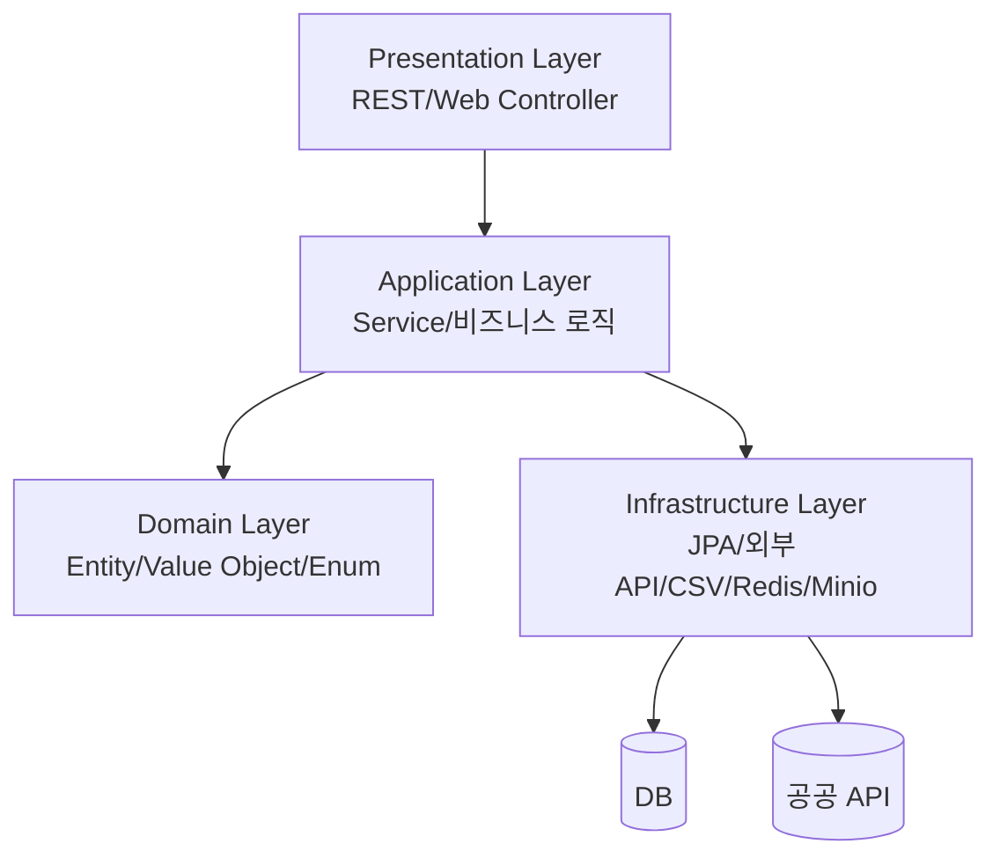

<br/>

# Public Data Harvester (통신판매 사업자 정보 관리 시스템)

## 프로젝트 소개

**Public Data Harvester**는 시/도(city), 구/군(district) 정보를 입력받아,
공공 데이터(CSV)와 외부 API(법인등록번호, 행정구역코드)를 활용해
통신판매 사업자 정보를 수집·가공·저장하는 백엔드 시스템입니다.

- **CSV 데이터 필터링**: 시/도, 구/군별 통신판매 사업자 데이터(CSV)에서 법인 데이터만 선별
- **공공 API 연동**: 법인등록번호, 행정구역코드 등 추가 정보 실시간 수집
- **비동기 병렬 처리**: 대량 데이터도 빠르게 처리 (CompletableFuture 기반)
- **유연한 저장소 구조**: JPA 기반, H2/PostgreSQL 등 DB 교체 용이
- **운영/관리 기능**: 캐시/레이트리밋/헬스체크/모니터링 내장
- **환경별 설정 분리**: dev/prod 프로필, application.yml 기반 설정


---

## 아키텍처

### 1. **DDD + 레이어드 아키텍처**



* **Presentation**: REST API, Web Controller, 관리자/사용자 인터페이스
* **Application**: 비즈니스 서비스, 트랜잭션, 비동기/병렬 처리
* **Domain**: 핵심 도메인 모델, 엔티티, 값 객체, Enum
* **Infrastructure**: JPA 저장소, 외부 API 클라이언트, 파일/캐시/레이트리밋 등

### 2. **주요 기술 스택**

* Spring Boot 3.x, Spring Data JPA, Spring Security, Actuator
* H2/PostgreSQL, Redis (환경별 선택)
* CompletableFuture, @Async (비동기)
* Minio (파일), OpenAPI(Swagger)
* Lombok, Jasypt(암호화), Testcontainers(테스트)

---

## 주요 기능

* **CSV 데이터 필터링 및 저장**: 시/도, 구/군별 CSV에서 법인 데이터만 추출, DB 저장
* **공공 API 연동**: 법인등록번호, 행정구역코드 실시간 조회 및 병합
* **비동기 병렬 처리**: 대량 데이터도 빠르게 처리 (CompletableFuture)
* **운영/관리**: 캐시/레이트리밋/헬스체크/모니터링 API 제공
* **환경별 설정**: dev(로컬+Redis+Minio), prod(H2+로컬파일) 등 profile별 분리

---

## 폴더 구조

```
src/
└── main/
    ├── java/
    │   └── com/antock/
    │       ├── api/
    │       │   ├── coseller/   # 통신판매 사업자 도메인
    │       │   ├── member/     # 회원 도메인
    │       │   ├── admin/      # 관리자 및 운영 기능
    │       │   ├── global/     # 공통/유틸/설정
    │       │   └── web/        # Web Controller (JSP 기반)
    └── resources/
        ├── application.yml
        ├── application-dev.yml
        └── application-prod.yml
```

---

## 장점 및 차별점

- **도메인 주도 설계(DDD) + 레이어드 아키텍처**로 유지보수성과 확장성 극대화
- **설정 기반 유연성**: API/DB/캐시/파일 등 환경별 손쉬운 전환
- **비동기 병렬 처리**: 대량 데이터도 빠르고 안정적으로 처리
- **운영/관리 편의성**: 헬스체크, 캐시/레이트리밋 모니터링, 관리자 API 내장
- **테스트/보안/암호화**: Testcontainers, Spring Security, Jasypt 등 적용

---

## 추후 예정

- WebClient + Reactor 기반 리액티브 병렬 처리로 확장 가능
- AOP 기반 공통 로깅(LogAspect) 추가 시 운영/디버깅 편의성 향상
- 엔티티-DTO 변환 Mapper/Assembler 패턴 적용 시 유지보수성 강화
- 대용량 CSV/에러처리 Robustness, 테스트 커버리지 추가


---

## 실행 방법

```bash
# 개발 환경 (dev, Redis/Minio 사용)
./gradlew runDev

# 운영 환경 (prod, H2/로컬파일 사용)
./gradlew runProd
```
