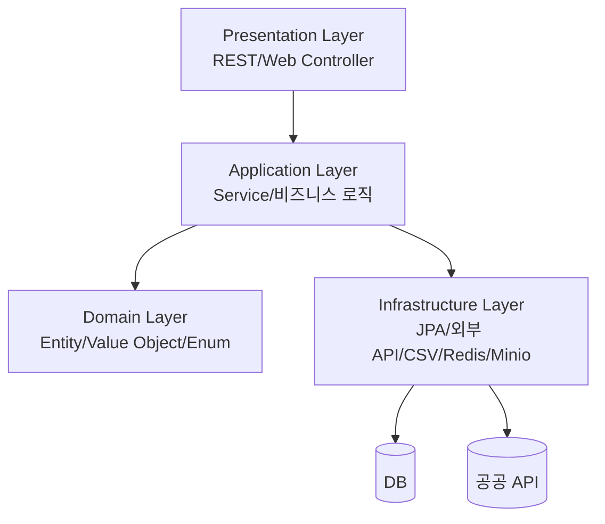

<br/>

# Public Data Harvester (통신판매 사업자 정보 관리 시스템)

## 프로젝트 소개

**Public Data Harvester**는 시/도(city), 구/군(district) 정보를 입력받아,
공공 데이터(CSV)와 외부 API(법인등록번호, 행정구역코드)를 활용해
통신판매 사업자 정보를 수집·가공·저장하는 백엔드 시스템입니다.

- **법인 정보 관리**: 법인 등록, 수정, 삭제, 검색
- **회원 관리**: 회원가입, 로그인, 권한 관리
- **파일 관리**: 파일 업로드/다운로드, MinIO/Local 저장소 지원
- **CSV 배치 처리**: 대량 데이터 처리 및 내보내기
- **대시보드**: 지역별 통계 및 성능 모니터링
- **캐시 관리**: Redis/Memory 기반 캐시 시스템
- **보안**: JWT 기반 인증, Rate Limiting

---

## 문서

기능 명세와 다이어그램은 `j_backend/src/main/resources/docs`에 있다.

- [기능 요구사항](j_backend/src/main/resources/docs/FRS.md)
- [유스케이스 시나리오](j_backend/src/main/resources/docs/UsecaseScenario.md)
- [컴포넌트 다이어그램](j_backend/src/main/resources/docs/diagram/ComponentDiagram.md)
- [시퀀스 다이어그램](j_backend/src/main/resources/docs/diagram/sequence/README.md)
  - [로그인·인증](j_backend/src/main/resources/docs/diagram/sequence/01_authentication.md)
  - [사용자 관리](j_backend/src/main/resources/docs/diagram/sequence/02_user_management.md)
  - [이메일](j_backend/src/main/resources/docs/diagram/sequence/03_email_service.md)
  - [계정 잠금](j_backend/src/main/resources/docs/diagram/sequence/04_security_account_lock.md)
  - [법인 정보](j_backend/src/main/resources/docs/diagram/sequence/05_corporation_management.md)
  - [파일 관리](j_backend/src/main/resources/docs/diagram/sequence/06_file_management.md)
  - [대시보드·통계](j_backend/src/main/resources/docs/diagram/sequence/07_dashboard_statistics.md)

같은 폴더의 SQL 파일은 스키마 보정과 점검용이다.

---

## 아키텍처

### 1. public-data-harvester 아키텍처


```mermaid
graph TD
    Controller[Presentation Layer<br/>REST/Web Controller]
    Service[Application Layer<br/>Service/비즈니스 로직]
    Domain[Domain Layer<br/>Entity/Value Object/Enum]
    Infra[Infrastructure Layer<br/>JPA/외부 API/CSV/Redis/Minio]
    DB[(DB)]
    API[(공공 API)]
    Controller --> Service
    Service --> Domain
    Service --> Infra
    Infra --> DB
    Infra --> API
```

- **Presentation**: REST API, Web Controller, 관리자/사용자 인터페이스
- **Application**: 비즈니스 서비스, 트랜잭션, 비동기/병렬 처리
- **Domain**: 핵심 도메인 모델, 엔티티, 값 객체, Enum
- **Infrastructure**: JPA 저장소, 외부 API 클라이언트, 파일/캐시/레이트리밋 등

### 2. **주요 기술 스택**

- Spring Boot 3.x, Spring Data JPA, Spring Security, Actuator
- H2/PostgreSQL, Redis
- CompletableFuture, @Async
- 파일업로드, OpenAPI(Swagger)
- Lombok, 암호화, Testcontainers

---

## 주요 기능

- **CSV 데이터 필터링 및 저장**: 시/도, 구/군별 CSV에서 법인 데이터만 추출, DB 저장
- **공공 API 연동**: 법인등록번호, 행정구역코드 실시간 조회 및 병합
- **비동기 병렬 처리**: 대량 데이터도 빠르게 처리
- **운영/관리**: 캐시/레이트리밋/헬스체크/모니터링 API 제공
- **회원**: 역할은 USER, MANAGER, ADMIN. 상태는 승인 대기, 승인, 정지, 거부, 탈퇴. 로그인 실패 5회면 계정을 잠그고, 비밀번호 찾기 메일을 보낸다.
- **관리자**: 회원 승인·거부·역할 변경, 캐시와 Rate Limit 조회·차단·화이트리스트
- **법인 검색**: 법인명, 사업자번호, 판매자 ID, 법인등록번호, 지역. 결과는 Excel로 내보낸다.
- **파일**: 업로드 최대 100MB, 유형 검증, Local/MinIO, 다운로드
- **웹 화면**: JSP 로그인·회원가입·프로필, 관리자 법인/회원/파일/대시보드

---

## 폴더 구조

```
src/
└── main/
    ├── java/
    │   └── com/antock/
    │       ├── api/
    │       │   ├── coseller/   # 통신판매 사업자 도메인
    │       │   ├── member/     # 회원 도메인
    │       │   ├── admin/      # 관리자 및 운영 기능
    │       │   ├── global/     # 공통/유틸/설정
    │       │   └── web/        # Web Controller (JSP 기반)
    └── resources/
        ├── application.yml
        ├── application-dev.yml
        └── application-prod.yml
```

---

## 장점 및 차별점

- **설정 기반 유연성**: API/DB/캐시/파일 등 환경별 손쉬운 전환
- **비동기 병렬 처리**: 대량 데이터도 빠르고 안정적으로 처리
- **운영/관리 편의성**: 헬스체크, 캐시/레이트리밋 모니터링, 관리자 API 내장
- **테스트/보안/암호화**: Testcontainers, Spring Security, Jasypt 등 적용

---

## 추후 예정

- WebClient + Reactor 기반 리액티브 병렬 처리로 확장 가능
- AOP 기반 공통 로깅 추가 시 운영/디버깅 편의성 향상
- 엔티티-DTO 변환 Mapper/Assembler 패턴 적용 시 유지보수성 강화
- 대용량 CSV/에러처리 Robustness, 테스트 커버리지 추가

---

## 실행 방법

```bash
# 개발 환경
./gradlew runDev

# 운영 환경
./gradlew runProd
```

### API 테스트

```bash
# Swagger UI를 통한 테스트
# 또는 Postman Collection 사용
```

## 성능 최적화

### 캐싱 전략

- Redis 기반 분산 캐시
- Local Memory 캐시
- Cache Eviction 정책

Redis가 끊기면 서버마다 메모리 캐시와 요청 횟수를 따로 둔다.<br/>
장애 중 일관성보다 가용성 선택. 메모리 캐시 TTL은 1~5분이고, 요청 횟수 창과 차단 시간은 이 값과 따로 둔다.<br/>
Redis가 끊기면 헬스 상태는 DEGRADED이고 readiness에서는 빼 둔다. 10초마다 복구를 확인하고, UP으로 돌아오면 메모리 캐시를 비운다.<br/>

### 배치 처리

- Chunk 기반 처리
- 비동기 실행
- 재시도 메커니즘

### 데이터베이스 최적화

- 인덱스 최적화
- N+1 쿼리 방지
- Connection Pool 설정

법인 이력을 읽을 때 JDBC 문 개수. 2,001회는 배치 설정이 전혀 없을 때의 순수 N+1이다.<br/>
이 앱에는 처음부터 `default_batch_fetch_size: 16`이 있어서, `@BatchSize`만 빼면 2,001회가 되지 않는다.<br/>
이력을 화면에 보여주는 기능은 없고, `/dev/nplus1`은 이 횟수를 재는 측정용이다.<br/>

| 법인 수 | 배치 설정 없음 | 전역 `default_batch_fetch_size: 16` | `@BatchSize(100)` |
| ------: | -------------: | ----------------------------------: | ----------------: |
|   2,000 |        2,001회 |                               126회 |              21회 |
|     900 |          901회 |                                58회 |              10회 |

2,000건은 목록 1회에 2,000/16=125회, 2,000/100=20회가 더해진다. <br/>
900건은 1+900/16=58회, 1+900/100=10회다.<br/>

### CSV 저장

- 청크마다 커밋한다. 실패한 청크는 기록하고, 성공한 청크는 남긴다.
- 파일 경로는 `normalize`와 기준 경로 검사로 막는다.
- Redis가 끊기면 메모리로 요청을 받고, 복구되면 그 메모리 캐시를 비운다.
- 헬스 상태는 DEGRADED이고 readiness에서는 제외한다. 메모리 항목 TTL과 요청 횟수 창은 따로 둔다.
- 같은 사업자번호는 `ON CONFLICT`로 갱신한다. 빈 대표자명과 주소는 기존 값을 덮지 않는다.
- 이력 조회 쿼리 수는 위 표와 같다.
- 배치 없음 2,001회, 전역 16이면 126회, `@BatchSize(100)`이면 21회다.

## 문제 해결

### 일반적인 문제

1. **Redis 연결 실패**: Memory 캐시로 자동 Fallback. 장애 중 일관성보다 가용성 선택. 복구 후 메모리 캐시는 비운다.
2. **파일 업로드 실패**: 저장소 설정 확인
3. **JWT 토큰 만료**: Refresh Token 사용

### 로그 확인

```bash
# 애플리케이션 로그
tail -f logs/application.log

# 에러 로그
tail -f logs/error.log
```

## 지원

- **개발팀**: sleekydz86@naver.com
- **문서**: [API Documentation](http://localhost:8080/swagger-ui.html)
- **이슈**: GitHub Issues

## 트러블슈팅

- [Spring Security 테스트에서 커스텀 사용자 인증 객체 주입 문제 해결](https://velog.io/@sleekydevzero86/spring-security-test-with-custom-user)
- [대규모 더미 데이터 생성 시 N+1 문제 해결](https://velog.io/@sleekydevzero86/jpa-n-plus-1-solution)
