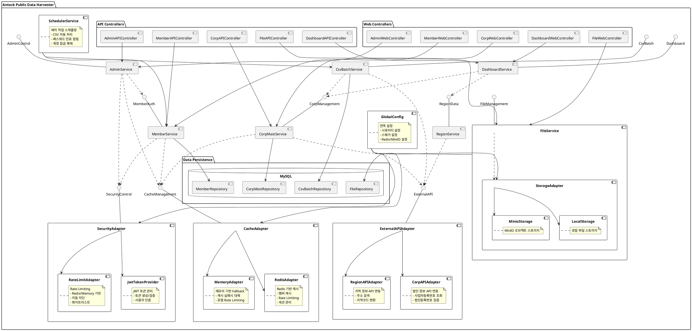

# Component Diagram - Antock Public Data Harvester

## 컴포넌트 설명

### 1. 핵심 서비스 컴포넌트

#### MemberService

- **역할**: 회원 관리 및 인증
- **주요 기능**:
  - 회원 가입/로그인
  - 패스워드 관리
  - 권한 관리 (ADMIN, MANAGER, USER)
  - 계정 상태 관리 (승인 대기, 승인, 정지, 거부, 탈퇴)

#### CorpMastService

- **역할**: 법인 정보 관리
- **주요 기능**:
  - 법인 정보 CRUD
  - 사업자번호/법인등록번호 검증
  - 지역별 법인 통계
  - Excel 내보내기

#### FileService

- **역할**: 파일 업로드/다운로드 관리
- **주요 기능**:
  - 파일 업로드/다운로드
  - 파일 메타데이터 관리
  - 스토리지 전략 (Local/MinIO)

#### DashboardService

- **역할**: 대시보드 및 통계
- **주요 기능**:
  - 지역별 통계
  - 최근 활동 내역
  - 시스템 현황

#### AdminService

- **역할**: 시스템 관리
- **주요 기능**:
  - 시스템 메트릭 모니터링
  - 캐시 관리
  - 회원 데이터 관리

#### CsvBatchService

- **역할**: CSV 배치 처리
- **주요 기능**:
  - 스케줄링된 CSV 처리
  - 외부 API 연동
  - 배치 이력 관리

### 2. 어댑터 컴포넌트

#### CacheAdapter

- **Redis 기반**: 분산 캐시, Rate Limiting
- **Memory 기반**: Redis 장애시 Fallback

#### SecurityAdapter

- **JWT Provider**: 토큰 기반 인증
- **Rate Limiter**: 요청 제한 및 보안

#### StorageAdapter

- **Local Storage**: 로컬 파일 시스템
- **MinIO Storage**: 오브젝트 스토리지

#### ExternalAPIAdapter

- **Corp API**: 법인 정보 조회
- **Region API**: 지역 정보 조회

### 3. 아키텍처 특징

1. **레이어드 아키텍처**: Controller → Service → Repository
2. **어댑터 패턴**: 외부 시스템 연동
3. **Fallback 메커니즘**: Redis 장애시 메모리 캐시 사용
4. **전략 패턴**: 파일 스토리지 전략 선택
5. **스케줄링**: 배치 작업 자동화
6. **캐싱**: 성능 최적화
7. **Rate Limiting**: 보안 및 안정성

이 컴포넌트 다이어그램은 시스템의 주요 구성 요소와 그들 간의 의존성을 명확히 보여주며, 확장 가능하고 유지보수가 용이한 아키텍처를 나타냅니다.
