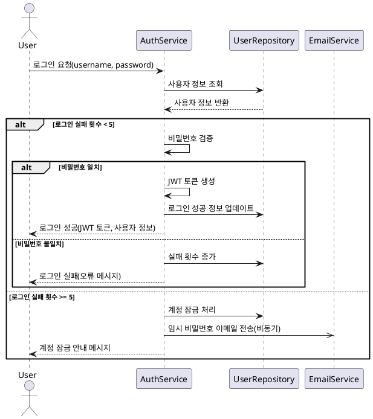

# 로그인/인증 기능 요구사항 명세서

## 1. 개요

사용자 로그인 및 인증 기능을 통해 시스템 접근 권한을 관리하고, 보안을 강화하는 기능입니다.

## 2. 기능 요구사항

### 2.1 사용자 로그인

#### 2.1.1 기본 로그인 프로세스

**FR-AUTH-001: 사용자 인증**

- **설명**: 사용자명과 비밀번호를 통한 기본 인증
- **입력**: 사용자명(username), 비밀번호(password)
- **출력**: JWT 토큰, 사용자 정보
- **제약조건**:
  - 사용자명과 비밀번호는 필수 입력
  - 승인된 계정(APPROVED 상태)만 로그인 가능

**FR-AUTH-002: 사용자 정보 조회**

- **설명**: 로그인 시 데이터베이스에서 사용자 정보를 조회
- **처리주체**: UserRepository
- **검증항목**:
  - 사용자 존재 여부
  - 계정 상태(status)
  - 계정 잠금 여부

**FR-AUTH-003: 비밀번호 검증**

- **설명**: 입력된 비밀번호와 저장된 암호화 비밀번호 비교
- **처리방식**: BCrypt 해시 비교
- **실패처리**: 로그인 실패 횟수 증가

### 2.2 로그인 실패 처리

**FR-AUTH-004: 로그인 실패 카운트 관리**

- **설명**: 로그인 실패 시 실패 횟수를 증가시키고 추적
- **저장위치**: 데이터베이스 member 테이블의 failed_login_attempts 필드
- **제한조건**: 최대 5회까지 허용

**FR-AUTH-005: 계정 잠금 처리**

- **조건**: 로그인 실패 횟수가 5회 이상일 때
- **처리내용**:
  - 계정 상태를 LOCKED로 변경
  - 잠금 시간 기록
  - 추가 로그인 시도 차단
- **해제조건**: 관리자에 의한 수동 해제 또는 자동 해제(24시간 후)

### 2.3 임시 비밀번호 발급

**FR-AUTH-006: 임시 비밀번호 이메일 전송**

- **조건**: 로그인 실패 5회 도달 시 자동 실행
- **처리내용**:
  - 임시 비밀번호 생성 (8자리 영문+숫자 조합)
  - 이메일을 통한 임시 비밀번호 전송
  - 기존 비밀번호는 유지 (임시 비밀번호와 병행 사용 가능)
- **보안조치**:
  - 임시 비밀번호는 24시간 후 만료
  - 최초 로그인 시 비밀번호 변경 강제

### 2.4 JWT 토큰 관리

**FR-AUTH-007: JWT 토큰 발급**

- **조건**: 로그인 성공 시
- **포함정보**:
  - 사용자 ID
  - 사용자명
  - 역할(Role)
  - 발급시간
  - 만료시간
- **유효기간**: 8시간

**FR-AUTH-008: 토큰 검증**

- **시점**: 모든 API 요청 시
- **검증항목**:
  - 토큰 서명 유효성
  - 토큰 만료 여부
  - 사용자 활성 상태

## 3. 시퀀스 다이어그램



## 4. 비기능 요구사항

### 4.1 보안 요구사항

**NFR-AUTH-001: 비밀번호 암호화**

- BCrypt 알고리즘을 사용한 단방향 암호화
- Salt 라운드: 12회

**NFR-AUTH-002: Rate Limiting**

- IP별 로그인 시도 제한: 분당 10회
- 전체 로그인 요청 제한: 초당 100회

**NFR-AUTH-003: 세션 보안**

- JWT 토큰을 통한 Stateless 인증
- HTTPS 통신 강제
- XSS, CSRF 방어

### 4.2 성능 요구사항

**NFR-AUTH-004: 응답 시간**

- 로그인 요청 처리: 2초 이내
- 토큰 검증: 100ms 이내

**NFR-AUTH-005: 동시 접속**

- 최대 1,000명 동시 로그인 지원

### 4.3 가용성 요구사항

**NFR-AUTH-006: 장애 대응**

- 이메일 서비스 장애 시 로그인 기능은 정상 동작
- 데이터베이스 일시 장애 시 재시도 매커니즘

## 5. 데이터 모델

### 5.1 Member 테이블

```sql
- id: BIGINT (PK)
- username: VARCHAR(50) (UK)
- password: VARCHAR(255)
- email: VARCHAR(100) (UK)
- status: ENUM('PENDING', 'APPROVED', 'SUSPENDED', 'REJECTED', 'WITHDRAWN')
- role: ENUM('USER', 'MANAGER', 'ADMIN')
- failed_login_attempts: INT DEFAULT 0
- last_login_at: TIMESTAMP
- account_locked_at: TIMESTAMP
- created_at: TIMESTAMP
- updated_at: TIMESTAMP
```

### 5.2 Member Password History 테이블

```sql
- id: BIGINT (PK)
- member_id: BIGINT (FK)
- old_password: VARCHAR(255)
- changed_at: TIMESTAMP
```

## 6. API 명세

### 6.1 로그인 API

```http
POST /api/auth/login
Content-Type: application/json

{
  "username": "testuser",
  "password": "password123"
}

Response (성공):
{
  "success": true,
  "data": {
    "token": "eyJhbGciOiJIUzI1NiJ9...",
    "user": {
      "id": 1,
      "username": "testuser",
      "role": "USER",
      "status": "APPROVED"
    }
  }
}

Response (실패):
{
  "success": false,
  "error": {
    "code": "LOGIN_FAILED",
    "message": "아이디 또는 비밀번호가 올바르지 않습니다."
  }
}
```

### 6.2 토큰 검증 API

```http
GET /api/auth/verify
Authorization: Bearer {JWT_TOKEN}

Response:
{
  "success": true,
  "data": {
    "valid": true,
    "user": {
      "id": 1,
      "username": "testuser",
      "role": "USER"
    }
  }
}
```

## 7. 테스트 케이스

### 7.1 정상 케이스

- TC-AUTH-001: 유효한 계정으로 로그인 성공
- TC-AUTH-002: JWT 토큰 발급 및 검증
- TC-AUTH-003: 로그인 후 사용자 정보 조회

### 7.2 예외 케이스

- TC-AUTH-004: 존재하지 않는 사용자명으로 로그인 시도
- TC-AUTH-005: 잘못된 비밀번호로 로그인 시도
- TC-AUTH-006: 5회 로그인 실패 후 계정 잠금
- TC-AUTH-007: 잠긴 계정으로 로그인 시도
- TC-AUTH-008: 승인되지 않은 계정으로 로그인 시도
- TC-AUTH-009: 만료된 JWT 토큰으로 API 호출
- TC-AUTH-010: 유효하지 않은 JWT 토큰으로 API 호출

## 8. 구현 시 고려사항

### 8.1 보안 고려사항

- 비밀번호는 반드시 암호화하여 저장
- 로그인 실패 로그 기록 및 모니터링
- 브루트 포스 공격 방지를 위한 Rate Limiting

### 8.2 사용성 고려사항

- 명확한 오류 메시지 제공
- 계정 잠금 시 해제 방법 안내
- 임시 비밀번호 발급 시 이메일 확인 안내

### 8.3 운영 고려사항

- 로그인 통계 및 모니터링
- 계정 잠금 해제를 위한 관리자 도구
- 비밀번호 정책 관리 기능
