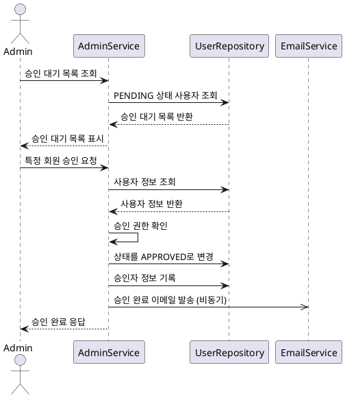
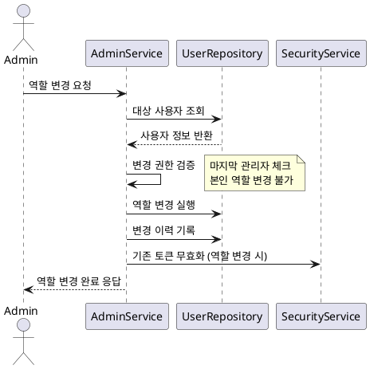

# 사용자 관리 기능 요구사항 명세서

## 1. 개요

관리자가 시스템 사용자를 관리하는 기능으로, 회원 가입 승인, 권한 변경, 계정 상태 관리 등을 포함합니다.

## 2. 기능 요구사항

### 2.1 회원 가입 관리

#### 2.1.1 회원 가입 신청

**FR-USER-001: 회원 가입 신청**

- **설명**: 신규 사용자의 회원 가입 신청 처리
- **입력**: 사용자명, 비밀번호, 닉네임, 이메일
- **처리**:
  - 중복 체크 (사용자명, 이메일)
  - 비밀번호 정책 검증
  - 기본 상태를 PENDING으로 설정
  - API 키 자동 생성
- **출력**: 가입 신청 완료 메시지

**FR-USER-002: 가입 승인 대기 목록 조회**

- **권한**: ADMIN
- **설명**: 승인 대기 중인 회원 목록을 조회
- **필터조건**: 상태(PENDING), 가입일시 범위
- **정렬**: 가입 신청일시 역순

#### 2.1.2 회원 승인 처리

**FR-USER-003: 회원 승인**

- **권한**: ADMIN
- **설명**: 가입 신청한 회원을 승인 처리
- **처리내용**:
  - 회원 상태를 APPROVED로 변경
  - 승인자 정보 기록
  - 승인 시간 기록
- **후처리**: 승인 완료 이메일 발송 (선택사항)

**FR-USER-004: 회원 거부**

- **권한**: ADMIN
- **설명**: 가입 신청을 거부 처리
- **처리내용**:
  - 회원 상태를 REJECTED로 변경
  - 거부 사유 입력 (선택사항)
  - 거부자 정보 기록
- **후처리**: 거부 안내 이메일 발송 (선택사항)

### 2.2 회원 정보 관리

#### 2.2.1 회원 목록 조회 및 검색

**FR-USER-005: 회원 목록 조회**

- **권한**: ADMIN, MANAGER
- **기능**:
  - 전체 회원 목록 조회
  - 페이징 처리 (기본 20개씩)
  - 상태별 필터링
  - 역할별 필터링
  - 가입일시 범위 검색

**FR-USER-006: 회원 검색**

- **검색조건**:
  - 사용자명 (부분 검색)
  - 닉네임 (부분 검색)
  - 이메일 (부분 검색)
- **검색결과**: 조건에 맞는 회원 목록 반환

#### 2.2.2 회원 상세 정보

**FR-USER-007: 회원 상세 조회**

- **권한**: ADMIN, MANAGER (본인 정보는 모든 사용자)
- **포함정보**:
  - 기본 정보 (사용자명, 닉네임, 이메일)
  - 계정 상태 및 역할
  - 로그인 통계 (마지막 로그인, 총 로그인 횟수)
  - 가입일시, 승인일시
  - 비밀번호 변경 이력

### 2.3 권한 및 상태 관리

#### 2.3.1 역할 변경

**FR-USER-008: 사용자 역할 변경**

- **권한**: ADMIN
- **역할종류**: USER, MANAGER, ADMIN
- **제약조건**:
  - 마지막 관리자(ADMIN)의 역할 변경 불가
  - 본인의 역할 변경 불가
- **변경이력**: 역할 변경 로그 기록

#### 2.3.2 계정 상태 관리

**FR-USER-009: 계정 정지**

- **권한**: ADMIN
- **설명**: 특정 사용자의 계정을 정지 처리
- **처리내용**:
  - 상태를 SUSPENDED로 변경
  - 정지 사유 입력
  - 정지 기간 설정 (선택사항)
  - 기존 JWT 토큰 무효화

**FR-USER-010: 계정 정지 해제**

- **권한**: ADMIN
- **설명**: 정지된 계정을 다시 활성화
- **처리내용**:
  - 상태를 APPROVED로 변경
  - 해제 사유 입력
  - 해제자 정보 기록

**FR-USER-011: 계정 탈퇴 처리**

- **권한**: ADMIN (또는 본인)
- **설명**: 사용자 계정을 탈퇴 처리
- **처리내용**:
  - 상태를 WITHDRAWN으로 변경
  - 개인정보 비식별화 처리
  - 관련 데이터 보존 정책 적용

### 2.4 사용자 통계 및 모니터링

**FR-USER-012: 사용자 통계**

- **권한**: ADMIN, MANAGER
- **통계항목**:
  - 상태별 사용자 수
  - 역할별 사용자 수
  - 월별 가입자 수
  - 일별/월별 활성 사용자 수

**FR-USER-013: 로그인 통계**

- **권한**: ADMIN
- **통계항목**:
  - 일별/월별 로그인 수
  - 사용자별 로그인 패턴
  - 실패한 로그인 시도 통계

## 3. 시퀀스 다이어그램

### 3.1 회원 승인 프로세스



### 3.2 사용자 역할 변경 프로세스



## 4. 비기능 요구사항

### 4.1 성능 요구사항

**NFR-USER-001: 응답 시간**

- 회원 목록 조회: 3초 이내
- 회원 검색: 2초 이내
- 상태 변경: 1초 이내

**NFR-USER-002: 동시 처리**

- 동시 관리 작업: 최대 50건
- 대용량 사용자 목록 처리: 10,000명까지

### 4.2 보안 요구사항

**NFR-USER-003: 권한 검증**

- 모든 관리 기능은 적절한 권한 확인 필수
- 작업 로그 기록 및 추적 가능

**NFR-USER-004: 데이터 보호**

- 개인정보 마스킹 처리
- 민감한 정보 암호화 저장

### 4.3 가용성 요구사항

**NFR-USER-005: 데이터 일관성**

- 상태 변경 시 트랜잭션 보장
- 롤백 매커니즘 제공

## 5. 데이터 모델

### 5.1 Member 테이블 확장

```sql
- approved_by: BIGINT (FK to Member) -- 승인자 ID
- approved_at: TIMESTAMP -- 승인 시간
- rejected_by: BIGINT (FK to Member) -- 거부자 ID
- rejected_at: TIMESTAMP -- 거부 시간
- rejection_reason: TEXT -- 거부 사유
- suspended_by: BIGINT (FK to Member) -- 정지 처리자 ID
- suspended_at: TIMESTAMP -- 정지 시간
- suspension_reason: TEXT -- 정지 사유
- suspension_until: TIMESTAMP -- 정지 해제 예정일
```

### 5.2 Member Activity Log 테이블

```sql
- id: BIGINT (PK)
- member_id: BIGINT (FK)
- action_type: ENUM('APPROVE', 'REJECT', 'SUSPEND', 'ACTIVATE', 'ROLE_CHANGE')
- old_value: VARCHAR(100) -- 변경 전 값
- new_value: VARCHAR(100) -- 변경 후 값
- reason: TEXT -- 변경 사유
- performed_by: BIGINT (FK to Member) -- 수행자 ID
- performed_at: TIMESTAMP
```

## 6. API 명세

### 6.1 회원 목록 조회 API

```http
GET /api/admin/members?page=0&size=20&status=PENDING&role=USER
Authorization: Bearer {JWT_TOKEN}

Response:
{
  "success": true,
  "data": {
    "content": [
      {
        "id": 1,
        "username": "testuser",
        "nickname": "테스트유저",
        "email": "test@example.com",
        "status": "PENDING",
        "role": "USER",
        "createdAt": "2024-01-01T00:00:00",
        "lastLoginAt": null
      }
    ],
    "page": 0,
    "size": 20,
    "totalElements": 1,
    "totalPages": 1
  }
}
```

### 6.2 회원 승인 API

```http
POST /api/admin/members/{memberId}/approve
Authorization: Bearer {JWT_TOKEN}

Response:
{
  "success": true,
  "message": "회원이 성공적으로 승인되었습니다.",
  "data": {
    "id": 1,
    "status": "APPROVED",
    "approvedAt": "2024-01-01T12:00:00",
    "approvedBy": "admin"
  }
}
```

### 6.3 역할 변경 API

```http
PUT /api/admin/members/{memberId}/role
Authorization: Bearer {JWT_TOKEN}
Content-Type: application/json

{
  "role": "MANAGER",
  "reason": "업무 필요에 의한 권한 상승"
}

Response:
{
  "success": true,
  "message": "사용자 역할이 변경되었습니다.",
  "data": {
    "id": 1,
    "oldRole": "USER",
    "newRole": "MANAGER",
    "changedAt": "2024-01-01T12:00:00"
  }
}
```

## 7. 테스트 케이스

### 7.1 정상 케이스

- TC-USER-001: 관리자가 승인 대기 목록 조회
- TC-USER-002: 가입 신청 회원 승인 처리
- TC-USER-003: 가입 신청 회원 거부 처리
- TC-USER-004: 사용자 역할 변경
- TC-USER-005: 계정 정지 및 해제
- TC-USER-006: 회원 검색 기능

### 7.2 예외 케이스

- TC-USER-007: 권한 없는 사용자의 관리 기능 접근
- TC-USER-008: 마지막 관리자의 역할 변경 시도
- TC-USER-009: 존재하지 않는 사용자 관리 시도
- TC-USER-010: 이미 처리된 신청에 대한 중복 처리
- TC-USER-011: 본인 계정 상태 변경 시도

## 8. 구현 시 고려사항

### 8.1 사용성 고려사항

- 직관적인 관리자 인터페이스 제공
- bulk 작업 기능 (일괄 승인/거부)
- 작업 결과에 대한 명확한 피드백

### 8.2 보안 고려사항

- 모든 관리 작업에 대한 로그 기록
- 중요한 작업에 대한 재확인 절차
- 권한 상승에 대한 승인 프로세스

### 8.3 운영 고려사항

- 관리자 작업 현황 모니터링
- 사용자 증가에 따른 성능 최적화
- 자동화 가능한 작업 식별 및 구현
