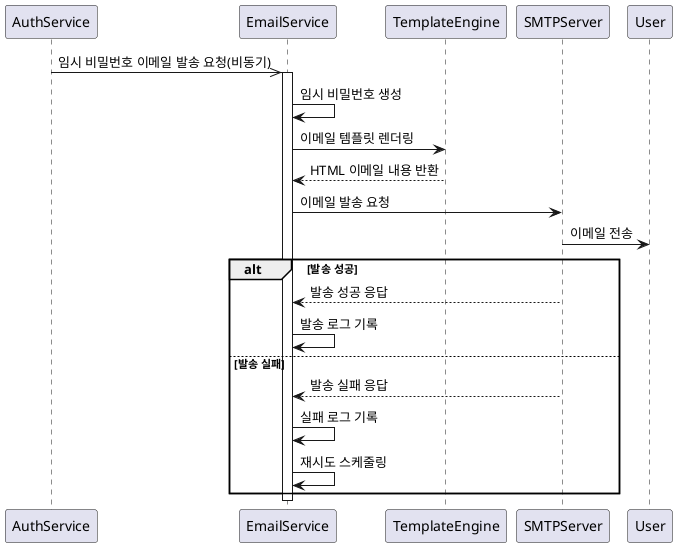
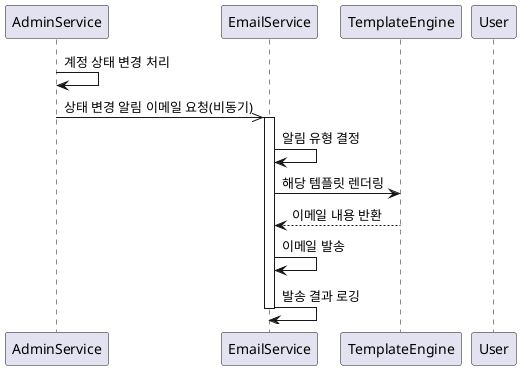

# 이메일 서비스 기능 요구사항 명세서

## 1. 개요

시스템에서 사용자에게 필요한 정보를 이메일로 전송하는 기능입니다. 주로 임시 비밀번호 발급, 계정 상태 변경 알림, 시스템 공지 등에 사용됩니다.

## 2. 기능 요구사항

### 2.1 임시 비밀번호 이메일 발송

#### 2.1.1 자동 발송 조건

**FR-EMAIL-001: 계정 잠금 시 임시 비밀번호 발송**

- **발송조건**: 로그인 실패 5회 이상으로 계정 잠금 시 자동 실행
- **발송방식**: 비동기 처리 (모킹)
- **처리주체**: EmailService
- **발송내용**:
  - 계정 잠금 안내
  - 임시 비밀번호 제공
  - 비밀번호 변경 안내
  - 계정 보안 주의사항

**FR-EMAIL-002: 임시 비밀번호 생성**

- **생성규칙**:
  - 8자리 영문 대소문자 + 숫자 조합
  - 특수문자 제외 (사용자 편의성)
  - 추측하기 어려운 랜덤 조합
- **유효기간**: 24시간
- **보안처리**:
  - 이메일 발송 후 해시화하여 저장
  - 일회성 사용 (사용 후 무효화)

#### 2.1.2 수동 발송

**FR-EMAIL-003: 관리자에 의한 임시 비밀번호 재발송**

- **권한**: ADMIN
- **발송조건**:
  - 사용자 요청에 의한 수동 발송
  - 이메일 미수신 시 재발송
- **제약조건**:
  - 하루 최대 3회까지 발송 가능
  - 마지막 발송으로부터 1시간 후 재발송 가능

### 2.2 계정 상태 변경 알림

**FR-EMAIL-004: 계정 승인 알림**

- **발송조건**: 관리자가 가입 신청을 승인한 경우
- **발송내용**:
  - 계정 승인 안내
  - 로그인 방법 안내
  - 시스템 이용 가이드 링크

**FR-EMAIL-005: 계정 거부 알림**

- **발송조건**: 관리자가 가입 신청을 거부한 경우
- **발송내용**:
  - 계정 거부 안내
  - 거부 사유 (입력된 경우)
  - 재신청 방법 안내

**FR-EMAIL-006: 계정 정지 알림**

- **발송조건**: 관리자가 계정을 정지 처리한 경우
- **발송내용**:
  - 계정 정지 안내
  - 정지 사유
  - 정지 기간 (설정된 경우)
  - 이의신청 방법

### 2.3 시스템 알림

**FR-EMAIL-007: 비밀번호 만료 알림**

- **발송조건**: 비밀번호 만료 7일 전, 3일 전, 1일 전
- **발송내용**:
  - 비밀번호 만료 예정일
  - 비밀번호 변경 방법
  - 보안 중요성 안내

**FR-EMAIL-008: 로그인 이상 활동 감지**

- **발송조건**:
  - 새로운 장소에서 로그인 시
  - 다수의 로그인 실패 시도 감지
- **발송내용**:
  - 로그인 시도 정보 (시간, IP, 위치)
  - 본인 활동 여부 확인
  - 계정 보안 강화 방법

### 2.4 이메일 템플릿 관리

**FR-EMAIL-009: 이메일 템플릿 시스템**

- **템플릿 종류**:
  - 임시 비밀번호 발송
  - 계정 상태 변경 알림
  - 시스템 공지사항
  - 보안 알림
- **다국어 지원**: 한국어, 영어 (확장 가능)
- **개인화**: 사용자명, 계정 정보 등 동적 삽입

**FR-EMAIL-010: 템플릿 버전 관리**

- **버전 관리**: 템플릿 변경 이력 관리
- **A/B 테스트**: 다른 템플릿 효과 비교 (선택사항)
- **미리보기**: 발송 전 이메일 내용 미리보기

## 3. 시퀀스 다이어그램

### 3.1 임시 비밀번호 이메일 발송



### 3.2 계정 상태 변경 알림



## 4. 비기능 요구사항

### 4.1 성능 요구사항

**NFR-EMAIL-001: 처리 성능**

- 이메일 발송 처리: 10초 이내
- 대량 발송: 시간당 1,000건
- 템플릿 렌더링: 1초 이내

**NFR-EMAIL-002: 동시 처리**

- 동시 이메일 발송: 최대 50건
- 큐 처리: FIFO 방식

### 4.2 신뢰성 요구사항

**NFR-EMAIL-003: 발송 안정성**

- 발송 성공률: 95% 이상
- 재시도 매커니즘: 최대 3회
- 실패 시 관리자 알림

**NFR-EMAIL-004: 데이터 보호**

- 이메일 내용 암호화 저장
- 개인정보 마스킹 처리
- 발송 로그 보안 저장

### 4.3 가용성 요구사항

**NFR-EMAIL-005: 서비스 가용성**

- 이메일 서비스 장애 시에도 시스템 정상 동작
- 오프라인 모드 지원 (발송 대기열)
- 복구 시 자동 재발송

## 5. 데이터 모델

### 5.1 Email Template 테이블

```sql
- id: BIGINT (PK)
- template_type: ENUM('TEMP_PASSWORD', 'ACCOUNT_APPROVED', 'ACCOUNT_REJECTED', 'ACCOUNT_SUSPENDED', 'PASSWORD_EXPIRY', 'SECURITY_ALERT')
- template_name: VARCHAR(100)
- subject: VARCHAR(200)
- content: TEXT
- language: VARCHAR(10) DEFAULT 'ko'
- version: INT DEFAULT 1
- is_active: BOOLEAN DEFAULT true
- created_at: TIMESTAMP
- updated_at: TIMESTAMP
```

### 5.2 Email Send Log 테이블

```sql
- id: BIGINT (PK)
- recipient_email: VARCHAR(100)
- template_type: VARCHAR(50)
- subject: VARCHAR(200)
- send_status: ENUM('PENDING', 'SENT', 'FAILED', 'RETRY')
- retry_count: INT DEFAULT 0
- error_message: TEXT
- sent_at: TIMESTAMP
- created_at: TIMESTAMP
```

### 5.3 Temporary Password 테이블

```sql
- id: BIGINT (PK)
- member_id: BIGINT (FK)
- temp_password: VARCHAR(255) -- 해시화된 임시 비밀번호
- expires_at: TIMESTAMP
- is_used: BOOLEAN DEFAULT false
- created_at: TIMESTAMP
```

## 6. API 명세

### 6.1 임시 비밀번호 발송 API (관리자용)

```http
POST /api/admin/members/{memberId}/send-temp-password
Authorization: Bearer {JWT_TOKEN}

Response:
{
  "success": true,
  "message": "임시 비밀번호가 이메일로 발송되었습니다.",
  "data": {
    "email": "user@example.com",
    "sentAt": "2024-01-01T12:00:00"
  }
}
```

### 6.2 이메일 발송 이력 조회 API

```http
GET /api/admin/emails?page=0&size=20&status=SENT
Authorization: Bearer {JWT_TOKEN}

Response:
{
  "success": true,
  "data": {
    "content": [
      {
        "id": 1,
        "recipientEmail": "user@example.com",
        "templateType": "TEMP_PASSWORD",
        "subject": "임시 비밀번호 발급 안내",
        "sendStatus": "SENT",
        "sentAt": "2024-01-01T12:00:00"
      }
    ],
    "page": 0,
    "size": 20,
    "totalElements": 1
  }
}
```

### 6.3 이메일 템플릿 관리 API

```http
GET /api/admin/email-templates
Authorization: Bearer {JWT_TOKEN}

Response:
{
  "success": true,
  "data": [
    {
      "id": 1,
      "templateType": "TEMP_PASSWORD",
      "templateName": "임시 비밀번호 발급",
      "subject": "임시 비밀번호 발급 안내",
      "language": "ko",
      "version": 1,
      "isActive": true
    }
  ]
}
```

## 7. 이메일 템플릿 예시

### 7.1 임시 비밀번호 발급 템플릿

```html
<!DOCTYPE html>
<html>
  <head>
    <meta charset="UTF-8" />
    <title>임시 비밀번호 발급 안내</title>
  </head>
  <body>
    <div style="max-width: 600px; margin: 0 auto; padding: 20px;">
      <h2>계정 보안 알림</h2>

      <p>안녕하세요, {{username}}님</p>

      <p>
        로그인 실패가 5회 이상 발생하여 보안을 위해 계정이 일시적으로 잠금
        처리되었습니다.
      </p>

      <div style="background-color: #f5f5f5; padding: 15px; margin: 20px 0;">
        <h3>임시 비밀번호</h3>
        <p style="font-size: 18px; font-weight: bold; color: #007bff;">
          {{tempPassword}}
        </p>
        <p style="color: #dc3545; font-size: 14px;">
          * 이 비밀번호는 24시간 후 만료됩니다.
        </p>
      </div>

      <h3>다음 단계</h3>
      <ol>
        <li>위의 임시 비밀번호로 로그인하세요.</li>
        <li>로그인 후 즉시 새로운 비밀번호로 변경하세요.</li>
        <li>보안을 위해 강력한 비밀번호를 사용하세요.</li>
      </ol>

      <div
        style="margin-top: 30px; padding-top: 20px; border-top: 1px solid #ddd;"
      >
        <p style="font-size: 12px; color: #666;">
          이 이메일은 자동으로 발송된 메일입니다.<br />
          문의사항이 있으시면 시스템 관리자에게 연락하세요.
        </p>
      </div>
    </div>
  </body>
</html>
```

### 7.2 계정 승인 알림 템플릿

```html
<!DOCTYPE html>
<html>
  <head>
    <meta charset="UTF-8" />
    <title>계정 승인 완료</title>
  </head>
  <body>
    <div style="max-width: 600px; margin: 0 auto; padding: 20px;">
      <h2 style="color: #28a745;">계정 승인 완료</h2>

      <p>안녕하세요, {{username}}님</p>

      <p>
        회원 가입 신청이 승인되었습니다. 이제 시스템을 정상적으로 이용하실 수
        있습니다.
      </p>

      <div
        style="background-color: #d4edda; padding: 15px; margin: 20px 0; border-left: 4px solid #28a745;"
      >
        <h3>계정 정보</h3>
        <p><strong>사용자명:</strong> {{username}}</p>
        <p><strong>이메일:</strong> {{email}}</p>
        <p><strong>승인일시:</strong> {{approvedAt}}</p>
      </div>

      <p>
        <a
          href="{{loginUrl}}"
          style="background-color: #007bff; color: white; padding: 10px 20px; text-decoration: none; border-radius: 5px;"
          >로그인 하기</a
        >
      </p>

      <div style="margin-top: 30px;">
        <h3>시작하기</h3>
        <ul>
          <li>사용자 가이드를 확인하세요</li>
          <li>프로필 정보를 업데이트하세요</li>
          <li>보안을 위해 정기적으로 비밀번호를 변경하세요</li>
        </ul>
      </div>
    </div>
  </body>
</html>
```

## 8. 테스트 케이스

### 8.1 정상 케이스

- TC-EMAIL-001: 계정 잠금 시 임시 비밀번호 이메일 자동 발송
- TC-EMAIL-002: 관리자에 의한 수동 임시 비밀번호 발송
- TC-EMAIL-003: 계정 승인 시 알림 이메일 발송
- TC-EMAIL-004: 계정 거부 시 알림 이메일 발송
- TC-EMAIL-005: 이메일 템플릿 정상 렌더링

### 8.2 예외 케이스

- TC-EMAIL-006: SMTP 서버 연결 실패 시 재시도
- TC-EMAIL-007: 잘못된 이메일 주소로 발송 시도
- TC-EMAIL-008: 일일 발송 한도 초과 시 제한
- TC-EMAIL-009: 템플릿 렌더링 오류 처리
- TC-EMAIL-010: 대용량 이메일 발송 시 성능 테스트

## 9. 구현 시 고려사항

### 9.1 보안 고려사항

- 이메일 내용에 민감한 정보 최소화
- 임시 비밀번호 생성 시 충분한 엔트로피 확보
- 발송 로그의 개인정보 보호

### 9.2 사용성 고려사항

- 명확하고 이해하기 쉬운 이메일 내용
- 모바일 디바이스에서도 읽기 쉬운 반응형 템플릿
- 다국어 지원 확장성 고려

### 9.3 운영 고려사항

- 이메일 발송 실패 모니터링 및 알림
- 스팸 필터 회피를 위한 최적화
- 발송량 증가에 따른 성능 최적화
- 이메일 서비스 프로바이더 변경 대응
