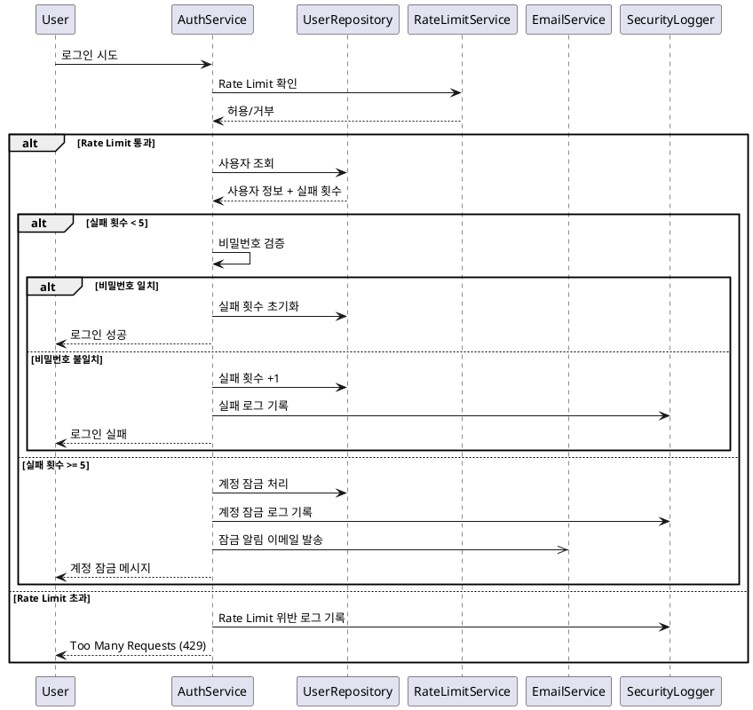
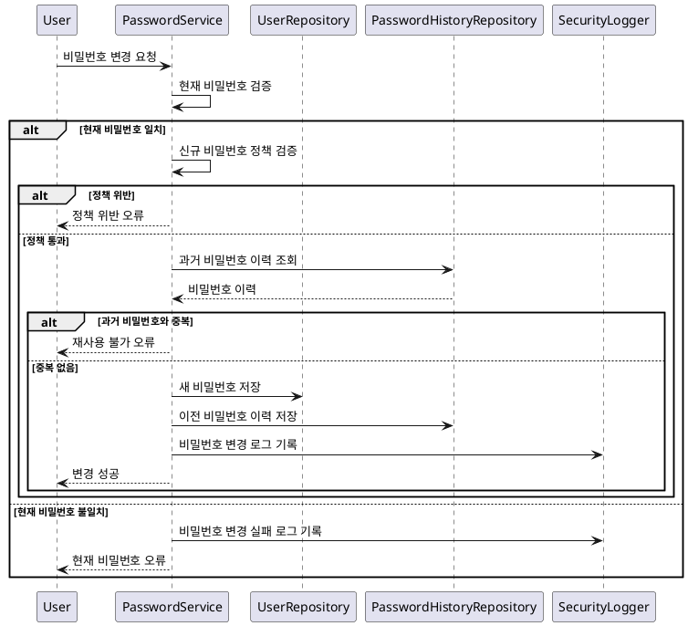

# 보안 및 계정 잠금 기능 요구사항 명세서

## 1. 개요

시스템 보안을 강화하고 브루트 포스 공격을 방지하기 위한 계정 잠금 및 보안 관리 기능입니다.

## 2. 기능 요구사항

### 2.1 계정 잠금 메커니즘

#### 2.1.1 로그인 실패 추적

**FR-SEC-001: 로그인 실패 횟수 관리**

- **설명**: 사용자별 로그인 실패 횟수를 추적하고 관리
- **저장위치**: 데이터베이스 member 테이블
- **증가조건**:
  - 잘못된 비밀번호 입력
  - 존재하지 않는 사용자명으로 로그인 시도
- **초기화조건**:
  - 로그인 성공 시 0으로 초기화
  - 관리자에 의한 수동 초기화

**FR-SEC-002: 실패 시도 로깅**

- **로그정보**:
  - 시도 시간
  - IP 주소
  - User Agent
  - 실패 사유
- **보존기간**: 90일
- **활용**: 보안 분석 및 패턴 감지

#### 2.1.2 자동 계정 잠금

**FR-SEC-003: 계정 잠금 조건**

- **잠금조건**: 연속 로그인 실패 5회 이상
- **잠금처리**:
  - 계정 상태를 LOCKED로 변경
  - 잠금 시간 기록
  - 기존 JWT 토큰 무효화
- **알림처리**:
  - 사용자에게 이메일 알림
  - 시스템 관리자에게 알림

**FR-SEC-004: 잠금 해제 메커니즘**

- **자동해제**: 24시간 후 자동 해제
- **수동해제**: 관리자에 의한 즉시 해제
- **해제처리**:
  - 실패 횟수 초기화
  - 계정 상태를 APPROVED로 변경
  - 해제 이력 기록

### 2.2 Rate Limiting

#### 2.2.1 IP 기반 제한

**FR-SEC-005: IP별 요청 제한**

- **제한규칙**:
  - 로그인 API: 분당 10회
  - 전체 API: 초당 100회
  - 파일 업로드: 시간당 50회
- **제한방식**:
  - Redis 기반 (우선)
  - 메모리 기반 (Fallback)

**FR-SEC-006: Rate Limit 초과 처리**

- **응답코드**: 429 Too Many Requests
- **차단시간**: 15분 (점진적 증가)
- **예외처리**: 화이트리스트 IP는 제한 면제

#### 2.2.2 사용자 기반 제한

**FR-SEC-007: 사용자별 API 제한**

- **제한규칙**:
  - 일반 사용자: 시간당 1,000회
  - 관리자: 시간당 5,000회
- **초과처리**: 일시적 API 접근 차단

### 2.3 비밀번호 보안 정책

#### 2.3.1 비밀번호 정책 강제

**FR-SEC-008: 비밀번호 복잡도 요구사항**

- **최소길이**: 8자 이상
- **필수조합**: 영문 대소문자 + 숫자
- **권장조합**: 특수문자 포함
- **금지패턴**:
  - 연속된 문자 (123456, abcdef)
  - 반복 문자 (aaaa, 1111)
  - 사용자명 포함

**FR-SEC-009: 비밀번호 이력 관리**

- **이력보관**: 최근 5개 비밀번호
- **재사용금지**: 이전에 사용한 비밀번호 재사용 불가
- **암호화저장**: BCrypt로 해시화하여 저장

#### 2.3.2 비밀번호 만료 정책

**FR-SEC-010: 정기적 비밀번호 변경**

- **만료주기**: 90일
- **알림시점**: 만료 7일, 3일, 1일 전
- **강제변경**: 만료 시 로그인 시 비밀번호 변경 강제

### 2.4 세션 보안 관리

#### 2.4.1 JWT 토큰 보안

**FR-SEC-011: 토큰 생성 및 검증**

- **알고리즘**: HS256 (HMAC SHA-256)
- **유효기간**: 8시간
- **갱신정책**: 만료 1시간 전 자동 갱신
- **무효화**: 로그아웃, 비밀번호 변경, 계정 잠금 시

**FR-SEC-012: 토큰 블랙리스트**

- **관리대상**: 무효화된 토큰
- **저장방식**: Redis (만료시간과 함께)
- **검증**: 모든 요청 시 블랙리스트 확인

#### 2.4.2 동시 세션 관리

**FR-SEC-013: 다중 로그인 제어**

- **허용기준**: 사용자당 최대 3개 세션
- **초과처리**: 가장 오래된 세션 자동 종료
- **알림**: 새로운 장소에서 로그인 시 이메일 알림

### 2.5 보안 모니터링

#### 2.5.1 이상 활동 감지

**FR-SEC-014: 의심스러운 활동 패턴 감지**

- **감지패턴**:
  - 단시간 내 다수 실패 로그인
  - 비정상적인 지역에서 로그인
  - 패턴 없는 대량 API 호출
- **대응방안**:
  - 자동 계정 잠금
  - 관리자 알림
  - IP 차단 (임시)

**FR-SEC-015: 보안 로그 관리**

- **로그종류**:
  - 로그인/로그아웃 이벤트
  - 권한 변경 이벤트
  - 비밀번호 변경 이벤트
  - Rate Limit 위반 이벤트
- **보관기간**: 1년
- **접근권한**: 관리자만 조회 가능

## 3. 시퀀스 다이어그램

### 3.1 계정 잠금 프로세스



### 3.2 비밀번호 변경 및 정책 검증



## 4. 비기능 요구사항

### 4.1 성능 요구사항

**NFR-SEC-001: 응답 시간**

- Rate Limit 확인: 50ms 이내
- 로그인 보안 검사: 200ms 이내
- 비밀번호 정책 검증: 100ms 이내

**NFR-SEC-002: 처리 용량**

- 동시 로그인 시도: 1,000건/초
- Rate Limit 처리: 10,000건/초

### 4.2 신뢰성 요구사항

**NFR-SEC-003: 가용성**

- 보안 기능 가동률: 99.9%
- Redis 장애 시 메모리 Fallback
- 보안 로그 무손실 보장

**NFR-SEC-004: 데이터 일관성**

- 실패 횟수 카운트 정확성
- 토큰 블랙리스트 동기화
- 로그 데이터 무결성

### 4.3 보안 요구사항

**NFR-SEC-005: 암호화**

- 비밀번호: BCrypt (12 rounds)
- 로그 데이터: AES-256 암호화
- 전송 데이터: TLS 1.3

## 5. 데이터 모델

### 5.1 Security Log 테이블

```sql
- id: BIGINT (PK)
- event_type: ENUM('LOGIN_SUCCESS', 'LOGIN_FAILED', 'ACCOUNT_LOCKED', 'PASSWORD_CHANGED', 'RATE_LIMIT_EXCEEDED')
- member_id: BIGINT (FK)
- ip_address: VARCHAR(45)
- user_agent: TEXT
- details: JSON
- created_at: TIMESTAMP
- INDEX idx_member_created (member_id, created_at)
- INDEX idx_event_created (event_type, created_at)
```

### 5.2 Rate Limit 테이블 (메모리 Fallback용)

```sql
- id: BIGINT (PK)
- identifier: VARCHAR(100) -- IP 또는 사용자 ID
- limit_type: ENUM('IP_LOGIN', 'IP_API', 'USER_API')
- request_count: INT
- window_start: TIMESTAMP
- blocked_until: TIMESTAMP
- INDEX idx_identifier_type (identifier, limit_type)
```

### 5.3 Token Blacklist 테이블 (Redis Fallback용)

```sql
- id: BIGINT (PK)
- token_jti: VARCHAR(255) -- JWT ID
- member_id: BIGINT (FK)
- revoked_at: TIMESTAMP
- expires_at: TIMESTAMP
- reason: VARCHAR(100)
- INDEX idx_jti (token_jti)
- INDEX idx_expires (expires_at)
```

## 6. API 명세

### 6.1 계정 잠금 해제 API

```http
POST /api/admin/members/{memberId}/unlock
Authorization: Bearer {JWT_TOKEN}
Content-Type: application/json

{
  "reason": "사용자 요청에 의한 해제"
}

Response:
{
  "success": true,
  "message": "계정 잠금이 해제되었습니다.",
  "data": {
    "memberId": 1,
    "unlockedAt": "2024-01-01T12:00:00",
    "unlockedBy": "admin"
  }
}
```

### 6.2 보안 로그 조회 API

```http
GET /api/admin/security-logs?page=0&size=20&eventType=LOGIN_FAILED&fromDate=2024-01-01
Authorization: Bearer {JWT_TOKEN}

Response:
{
  "success": true,
  "data": {
    "content": [
      {
        "id": 1,
        "eventType": "LOGIN_FAILED",
        "memberId": 1,
        "ipAddress": "192.168.1.100",
        "userAgent": "Mozilla/5.0...",
        "details": {
          "reason": "WRONG_PASSWORD",
          "attemptCount": 3
        },
        "createdAt": "2024-01-01T12:00:00"
      }
    ],
    "totalElements": 1
  }
}
```

### 6.3 Rate Limit 상태 조회 API

```http
GET /api/admin/rate-limits/{identifier}
Authorization: Bearer {JWT_TOKEN}

Response:
{
  "success": true,
  "data": {
    "identifier": "192.168.1.100",
    "limits": [
      {
        "type": "IP_LOGIN",
        "currentCount": 8,
        "maxCount": 10,
        "windowStart": "2024-01-01T12:00:00",
        "resetTime": "2024-01-01T13:00:00"
      }
    ],
    "isBlocked": false
  }
}
```

## 7. 설정 및 구성

### 7.1 보안 정책 설정

```yaml
security:
  password:
    minLength: 8
    requireUppercase: true
    requireLowercase: true
    requireNumber: true
    requireSpecialChar: false
    historyCount: 5
    expiryDays: 90

  account:
    maxLoginAttempts: 5
    lockoutDuration: 24h
    autoUnlock: true

  rateLimit:
    login:
      maxAttempts: 10
      window: 1m
    api:
      maxRequests: 100
      window: 1s
    upload:
      maxUploads: 50
      window: 1h

  jwt:
    expirationTime: 8h
    refreshThreshold: 1h
    algorithm: HS256

  monitoring:
    logRetentionDays: 365
    alertThreshold:
      failedLogins: 20
      rateLimitViolations: 100
```

## 8. 테스트 케이스

### 8.1 정상 케이스

- TC-SEC-001: 정상 로그인 후 실패 횟수 초기화
- TC-SEC-002: 비밀번호 정책 준수 시 변경 성공
- TC-SEC-003: Rate Limit 범위 내 요청 정상 처리
- TC-SEC-004: 관리자에 의한 계정 잠금 해제
- TC-SEC-005: JWT 토큰 정상 검증

### 8.2 보안 테스트 케이스

- TC-SEC-006: 5회 로그인 실패 후 계정 자동 잠금
- TC-SEC-007: Rate Limit 초과 시 429 응답
- TC-SEC-008: 과거 비밀번호 재사용 시도 차단
- TC-SEC-009: 무효화된 토큰으로 API 호출 차단
- TC-SEC-010: 브루트 포스 공격 시뮬레이션

### 8.3 성능 테스트 케이스

- TC-SEC-011: 동시 1,000건 로그인 시도 처리
- TC-SEC-012: Rate Limit 동시 10,000건 처리
- TC-SEC-013: Redis 장애 시 메모리 Fallback 동작

## 9. 구현 시 고려사항

### 9.1 보안 고려사항

- 타이밍 공격 방지를 위한 일정한 응답 시간
- 보안 로그의 변조 방지
- 민감한 정보의 로그 기록 제외

### 9.2 성능 고려사항

- Redis 클러스터를 통한 Rate Limit 확장성
- 보안 로그의 비동기 처리
- 인덱스 최적화를 통한 조회 성능 향상

### 9.3 운영 고려사항

- 보안 이벤트 실시간 모니터링
- 자동화된 보안 정책 업데이트
- 정기적인 보안 감사 및 취약점 점검
- 장애 상황에서의 보안 수준 유지
