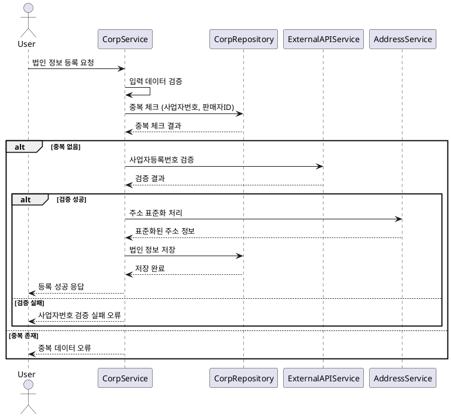
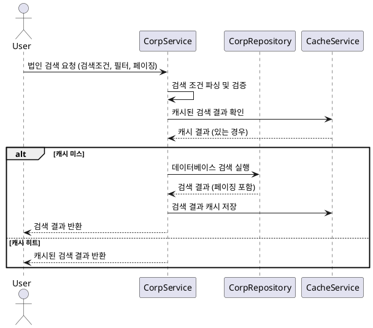
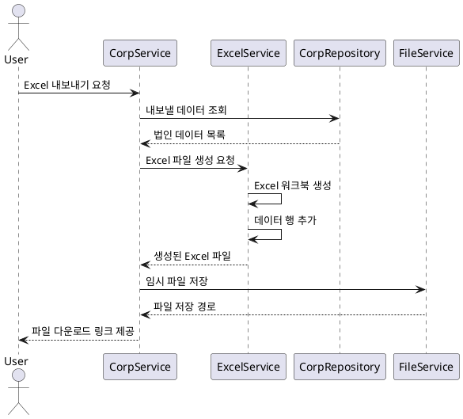

# 법인 정보 관리 기능 요구사항 명세서

## 1. 개요

법인 및 사업자 정보를 효율적으로 관리하고, 외부 API를 통한 검증 및 통계 기능을 제공하는 시스템입니다.

## 2. 기능 요구사항

### 2.1 법인 정보 등록

#### 2.1.1 기본 정보 등록

**FR-CORP-001: 법인 정보 등록**

- **설명**: 새로운 법인/사업자 정보를 시스템에 등록
- **입력데이터**:
  - 법인명 (필수)
  - 사업자등록번호 (필수, 10자리)
  - 법인등록번호 (선택, 13자리)
  - 대표자명 (필수)
  - 사업장 주소 (필수)
  - 판매자ID (필수, 유니크)
  - 업종 코드
  - 설립일
- **검증규칙**:
  - 사업자등록번호 중복 체크
  - 법인등록번호 중복 체크 (입력 시)
  - 판매자ID 중복 체크
  - 사업자등록번호 체크섬 검증

**FR-CORP-002: 외부 API 연동 검증**

- **설명**: 국세청 API를 통한 사업자등록번호 실시간 검증
- **검증항목**:
  - 사업자등록번호 유효성
  - 사업자 상태 (폐업, 휴업 여부)
  - 법인명 일치 여부
- **처리방식**:
  - 동기 처리 (등록 시점)
  - 배치 처리 (정기적 검증)

#### 2.1.2 주소 정보 처리

**FR-CORP-003: 주소 표준화**

- **설명**: 입력된 주소를 표준 형식으로 변환 및 저장
- **처리내용**:
  - 지번/도로명 주소 통합
  - 지역 코드 자동 매핑
  - 좌표 정보 추출 (가능한 경우)
- **외부연동**: 주소 검색 API 활용

### 2.2 법인 정보 조회 및 검색

#### 2.2.1 다양한 검색 옵션

**FR-CORP-004: 통합 검색 기능**

- **검색조건**:
  - 법인명 (부분 검색)
  - 사업자등록번호 (정확 검색)
  - 법인등록번호 (정확 검색)
  - 판매자ID (부분 검색)
  - 대표자명 (부분 검색)
  - 지역별 검색
  - 업종별 검색
- **정렬옵션**:
  - 등록일시 (기본: 최신순)
  - 법인명 (가나다순)
  - 지역별
  - 업종별

**FR-CORP-005: 고급 필터링**

- **필터조건**:
  - 등록일시 범위
  - 설립일 범위
  - 지역 (시도, 시군구)
  - 업종 분류
  - 등록자별
  - 검증 상태별
- **결과처리**: 페이징 처리 (기본 20개씩)

#### 2.2.2 상세 정보 조회

**FR-CORP-006: 법인 상세 조회**

- **포함정보**:
  - 기본 정보 (법인명, 사업자번호 등)
  - 주소 정보 (지번, 도로명, 지역코드)
  - 등록 정보 (등록자, 등록일시)
  - 수정 이력
  - 외부 검증 결과
- **권한관리**: 모든 인증된 사용자 조회 가능

### 2.3 법인 정보 수정 및 삭제

#### 2.3.1 정보 수정

**FR-CORP-007: 법인 정보 수정**

- **수정권한**: 등록자 본인 또는 관리자
- **수정가능항목**:
  - 법인명
  - 대표자명
  - 사업장 주소
  - 업종 코드
  - 기타 부가 정보
- **수정불가항목**:
  - 사업자등록번호
  - 법인등록번호
  - 판매자ID
- **이력관리**: 모든 수정 내역을 이력으로 보관

**FR-CORP-008: 수정 이력 관리**

- **이력정보**:
  - 수정 전/후 값
  - 수정자 정보
  - 수정 시간
  - 수정 사유 (선택)
- **조회권한**: 등록자, 관리자만 조회 가능

#### 2.3.2 정보 삭제

**FR-CORP-009: 법인 정보 삭제**

- **삭제권한**: 등록자 본인 또는 관리자
- **삭제방식**: Soft Delete (논리 삭제)
- **삭제처리**:
  - 삭제 플래그 설정
  - 삭제자 및 삭제 시간 기록
  - 검색 결과에서 제외
- **복구기능**: 관리자에 의한 삭제 취소 가능

### 2.4 Excel 내보내기

**FR-CORP-010: Excel 내보내기 기능**

- **내보내기 범위**: 검색 결과 전체 또는 선택된 항목
- **포함정보**:
  - 기본 법인 정보
  - 주소 정보
  - 등록 정보
  - 선택적 컬럼 설정 가능
- **파일형식**: Excel 2007+ (.xlsx)
- **다운로드**: 즉시 다운로드 또는 이메일 발송

### 2.5 법인 정보 배치 처리

#### 2.5.1 대량 등록

**FR-CORP-011: CSV 파일을 통한 대량 등록**

- **지원형식**: CSV, Excel
- **검증처리**:
  - 파일 형식 검증
  - 데이터 무결성 검증
  - 중복 데이터 처리
- **오류처리**:
  - 오류 항목 별도 표시
  - 부분 성공 허용
  - 오류 리포트 제공

#### 2.5.2 정기 검증

**FR-CORP-012: 스케줄링된 데이터 검증**

- **검증주기**: 매월 1회
- **검증내용**:
  - 사업자등록번호 유효성 재확인
  - 폐업/휴업 상태 확인
  - 법인명 변경 여부 확인
- **결과처리**:
  - 변경사항 자동 업데이트
  - 관리자에게 변경 보고서 제공

## 3. 시퀀스 다이어그램

### 3.1 법인 정보 등록 프로세스



### 3.2 법인 정보 검색 프로세스



### 3.3 Excel 내보내기 프로세스



## 4. 비기능 요구사항

### 4.1 성능 요구사항

**NFR-CORP-001: 응답 시간**

- 법인 정보 등록: 3초 이내
- 검색 결과 조회: 2초 이내
- Excel 내보내기: 10초 이내 (1,000건 기준)

**NFR-CORP-002: 처리 용량**

- 동시 검색 요청: 500건/초
- 대량 등록: 10,000건/배치
- Excel 내보내기: 최대 100,000건

### 4.2 확장성 요구사항

**NFR-CORP-003: 데이터 규모**

- 법인 정보: 최대 1,000만 건
- 검색 인덱스 최적화
- 파티셔닝을 통한 성능 유지

### 4.3 가용성 요구사항

**NFR-CORP-004: 서비스 가용성**

- 법인 관리 서비스: 99.9%
- 외부 API 장애 시에도 기본 기능 동작
- 캐시를 통한 성능 최적화

## 5. 데이터 모델

### 5.1 Corporation 테이블

```sql
- id: BIGINT (PK)
- corp_name: VARCHAR(200) NOT NULL
- business_number: VARCHAR(10) NOT NULL (UK)
- corp_number: VARCHAR(13) (UK)
- representative_name: VARCHAR(100) NOT NULL
- seller_id: VARCHAR(100) NOT NULL (UK)
- business_type_code: VARCHAR(10)
- establishment_date: DATE
- address_jibun: VARCHAR(500)
- address_road: VARCHAR(500)
- address_detail: VARCHAR(200)
- postal_code: VARCHAR(10)
- region_code: VARCHAR(10)
- latitude: DECIMAL(10,8)
- longitude: DECIMAL(11,8)
- is_verified: BOOLEAN DEFAULT false
- verification_date: TIMESTAMP
- is_deleted: BOOLEAN DEFAULT false
- created_by: BIGINT (FK to Member)
- created_at: TIMESTAMP
- updated_at: TIMESTAMP
- deleted_by: BIGINT (FK to Member)
- deleted_at: TIMESTAMP

INDEX idx_business_number (business_number)
INDEX idx_corp_name (corp_name)
INDEX idx_seller_id (seller_id)
INDEX idx_region_code (region_code)
INDEX idx_created_at (created_at)
```

### 5.2 Corporation History 테이블

```sql
- id: BIGINT (PK)
- corp_id: BIGINT (FK to Corporation)
- field_name: VARCHAR(50)
- old_value: TEXT
- new_value: TEXT
- change_reason: VARCHAR(500)
- changed_by: BIGINT (FK to Member)
- changed_at: TIMESTAMP

INDEX idx_corp_id_changed_at (corp_id, changed_at)
```

### 5.3 External Verification Log 테이블

```sql
- id: BIGINT (PK)
- corp_id: BIGINT (FK to Corporation)
- verification_type: ENUM('BUSINESS_NUMBER', 'CORP_NUMBER', 'ADDRESS')
- api_provider: VARCHAR(50)
- request_data: JSON
- response_data: JSON
- verification_result: ENUM('SUCCESS', 'FAILED', 'ERROR')
- verified_at: TIMESTAMP

INDEX idx_corp_id_verified_at (corp_id, verified_at)
```

## 6. API 명세

### 6.1 법인 정보 등록 API

```http
POST /api/corporations
Authorization: Bearer {JWT_TOKEN}
Content-Type: application/json

{
  "corpName": "테스트 주식회사",
  "businessNumber": "1234567890",
  "corpNumber": "1234567890123",
  "representativeName": "홍길동",
  "sellerId": "TEST_SELLER_001",
  "businessTypeCode": "47110",
  "establishmentDate": "2020-01-01",
  "addressJibun": "서울시 강남구 역삼동 123-45",
  "addressRoad": "서울시 강남구 테헤란로 123",
  "addressDetail": "6층",
  "postalCode": "12345"
}

Response:
{
  "success": true,
  "message": "법인 정보가 성공적으로 등록되었습니다.",
  "data": {
    "id": 1,
    "corpName": "테스트 주식회사",
    "businessNumber": "1234567890",
    "sellerId": "TEST_SELLER_001",
    "isVerified": true,
    "createdAt": "2024-01-01T12:00:00"
  }
}
```

### 6.2 법인 정보 검색 API

```http
GET /api/corporations?page=0&size=20&corpName=테스트&regionCode=11&sortBy=createdAt&sortDir=desc
Authorization: Bearer {JWT_TOKEN}

Response:
{
  "success": true,
  "data": {
    "content": [
      {
        "id": 1,
        "corpName": "테스트 주식회사",
        "businessNumber": "123-45-67890",
        "representativeName": "홍길동",
        "sellerId": "TEST_SELLER_001",
        "regionName": "서울특별시 강남구",
        "isVerified": true,
        "createdAt": "2024-01-01T12:00:00"
      }
    ],
    "page": 0,
    "size": 20,
    "totalElements": 1,
    "totalPages": 1
  }
}
```

### 6.3 Excel 내보내기 API

```http
POST /api/corporations/export
Authorization: Bearer {JWT_TOKEN}
Content-Type: application/json

{
  "searchConditions": {
    "corpName": "테스트",
    "regionCode": "11"
  },
  "exportColumns": [
    "corpName",
    "businessNumber",
    "representativeName",
    "addressRoad",
    "createdAt"
  ],
  "format": "xlsx"
}

Response:
{
  "success": true,
  "message": "Excel 파일이 생성되었습니다.",
  "data": {
    "downloadUrl": "/api/files/download/corp_export_20240101_120000.xlsx",
    "fileName": "corp_export_20240101_120000.xlsx",
    "recordCount": 150
  }
}
```

## 7. 테스트 케이스

### 7.1 정상 케이스

- TC-CORP-001: 유효한 데이터로 법인 정보 등록
- TC-CORP-002: 다양한 조건으로 법인 검색
- TC-CORP-003: 법인 정보 수정 및 이력 기록
- TC-CORP-004: Excel 내보내기 기능
- TC-CORP-005: CSV 파일을 통한 대량 등록

### 7.2 예외 케이스

- TC-CORP-006: 중복된 사업자번호로 등록 시도
- TC-CORP-007: 잘못된 사업자번호 형식 입력
- TC-CORP-008: 권한 없는 사용자의 수정 시도
- TC-CORP-009: 외부 API 장애 시 처리
- TC-CORP-010: 대용량 데이터 검색 성능 테스트

### 7.3 통합 테스트

- TC-CORP-011: 등록 → 검색 → 수정 → 삭제 전체 플로우
- TC-CORP-012: 배치 처리와 실시간 검색 연동
- TC-CORP-013: 캐시 일관성 확인

## 8. 구현 시 고려사항

### 8.1 성능 최적화

- 검색 성능을 위한 적절한 인덱스 설계
- 자주 사용되는 검색 결과 캐싱
- 대용량 데이터 처리를 위한 페이징 최적화

### 8.2 데이터 품질 관리

- 외부 API를 통한 실시간 검증
- 정기적인 데이터 품질 점검
- 이상 데이터 감지 및 알림

### 8.3 확장성 고려

- 마이크로서비스 아키텍처 대응
- API 버전 관리
- 새로운 법인 형태 추가 대응

### 8.4 보안 고려사항

- 민감한 법인 정보 암호화
- 접근 권한 세분화
- 감사 로그 유지
