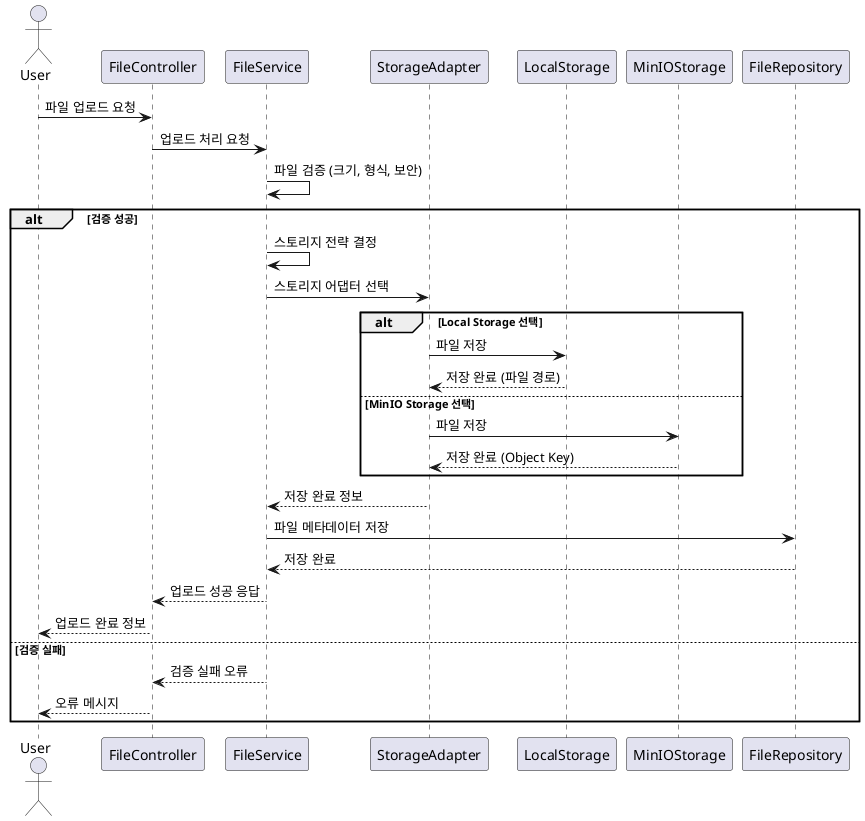
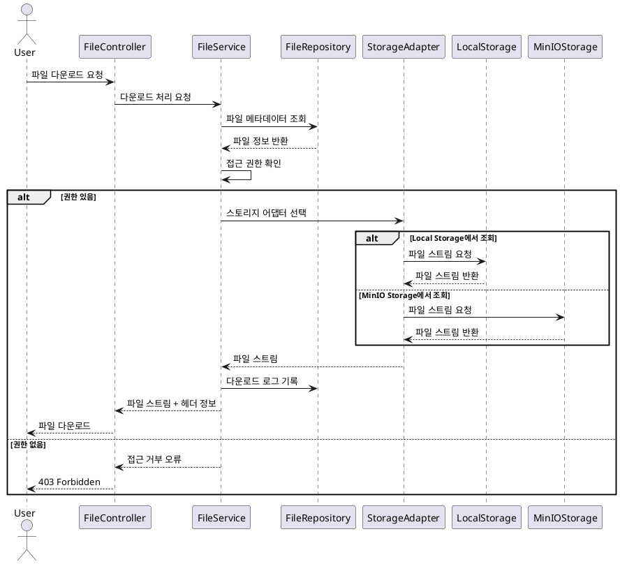
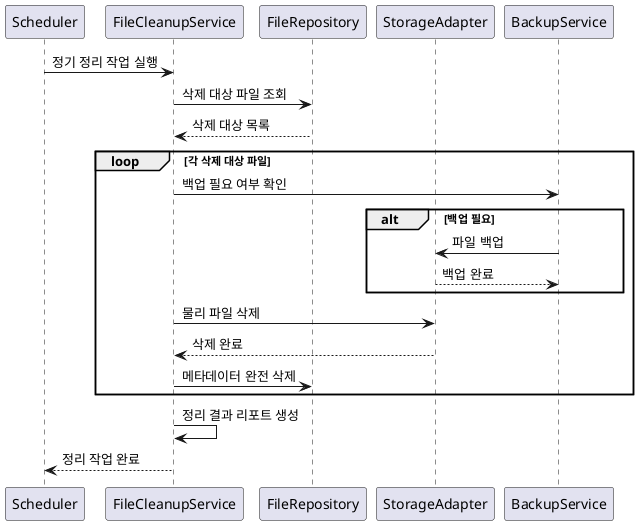

# 파일 관리 기능 요구사항 명세서

## 1. 개요

시스템에서 사용되는 파일의 업로드, 다운로드, 저장, 관리를 담당하는 기능입니다. Local Storage와 MinIO Object Storage를 지원하며, 확장 가능한 스토리지 전략을 제공합니다.

## 2. 기능 요구사항

### 2.1 파일 업로드

#### 2.1.1 단일 파일 업로드

**FR-FILE-001: 단일 파일 업로드**

- **설명**: 사용자가 개별 파일을 업로드하는 기능
- **지원형식**:
  - 문서: PDF, DOC, DOCX, XLS, XLSX, PPT, PPTX, TXT
  - 이미지: JPG, JPEG, PNG, GIF, BMP, WEBP
  - 압축파일: ZIP, RAR, 7Z
  - 기타: CSV, JSON, XML
- **파일크기제한**: 최대 100MB
- **검증처리**:
  - 파일 확장자 검증
  - MIME 타입 검증
  - 바이러스 스캔 (선택사항)
  - 파일 무결성 체크섬

**FR-FILE-002: 파일 메타데이터 생성**

- **자동생성정보**:
  - 고유 파일 ID (UUID)
  - 원본 파일명
  - 저장 파일명 (중복 방지)
  - 파일 크기
  - MIME 타입
  - 업로드 시간
  - 업로드자 정보
- **사용자입력정보**:
  - 파일 설명 (선택사항)
  - 카테고리/태그 (선택사항)

#### 2.1.2 다중 파일 업로드

**FR-FILE-003: 다중 파일 업로드**

- **설명**: 여러 파일을 한번에 업로드하는 기능
- **업로드방식**:
  - 드래그 앤 드롭 지원
  - 파일 선택 다이얼로그
  - 압축파일 내 파일 자동 추출 (선택사항)
- **처리방식**:
  - 병렬 업로드 (최대 5개 동시)
  - 실패 파일 개별 처리
  - 진행률 표시

#### 2.1.3 스토리지 전략

**FR-FILE-004: 저장소 선택 전략**

- **Local Storage**:
  - 소용량 파일 (< 10MB)
  - 임시 파일
  - 개발/테스트 환경
- **MinIO Storage**:
  - 대용량 파일 (>= 10MB)
  - 장기 보관 파일
  - 운영 환경
- **자동선택**: 파일 크기와 용도에 따른 자동 스토리지 선택

### 2.2 파일 다운로드

#### 2.2.1 직접 다운로드

**FR-FILE-005: 파일 다운로드**

- **설명**: 저장된 파일을 다운로드하는 기능
- **다운로드방식**:
  - 직접 다운로드 (스트리밍)
  - 임시 다운로드 링크 (24시간 유효)
  - 압축 다운로드 (다중 선택 시)
- **권한검증**: 파일 접근 권한 확인

**FR-FILE-006: 다운로드 로그 관리**

- **로그정보**:
  - 다운로드 시간
  - 다운로드자 정보
  - IP 주소
  - User Agent
- **통계활용**: 파일 사용 통계 생성

#### 2.2.2 미리보기 기능

**FR-FILE-007: 파일 미리보기**

- **지원형식**:
  - 이미지: 썸네일 생성 및 표시
  - PDF: 첫 페이지 미리보기
  - 텍스트: 내용 일부 표시
- **보안고려**: 민감한 파일의 미리보기 제한

### 2.3 파일 관리

#### 2.3.1 파일 목록 및 검색

**FR-FILE-008: 파일 목록 조회**

- **정렬옵션**:
  - 업로드 날짜 (기본: 최신순)
  - 파일명 (가나다순)
  - 파일 크기
  - 다운로드 횟수
- **필터옵션**:
  - 파일 형식별
  - 업로드자별
  - 업로드 날짜 범위
  - 파일 크기 범위

**FR-FILE-009: 파일 검색**

- **검색조건**:
  - 파일명 (부분 검색)
  - 파일 설명 (전체 텍스트 검색)
  - 태그/카테고리
  - 파일 내용 검색 (텍스트 파일 한정)
- **검색성능**: 인덱싱을 통한 빠른 검색

#### 2.3.2 파일 수정 및 삭제

**FR-FILE-010: 파일 정보 수정**

- **수정가능항목**:
  - 파일 설명
  - 카테고리/태그
  - 공개 범위 설정
- **수정권한**: 업로드자 본인 또는 관리자
- **수정이력**: 변경 내용 로그 기록

**FR-FILE-011: 파일 삭제**

- **삭제방식**: Soft Delete (논리 삭제)
- **삭제권한**: 업로드자 본인 또는 관리자
- **삭제처리**:
  - 파일 삭제 플래그 설정
  - 실제 파일은 30일 후 물리 삭제
  - 삭제 이력 기록

### 2.4 스토리지 관리

#### 2.4.1 스토리지 모니터링

**FR-FILE-012: 스토리지 사용량 모니터링**

- **모니터링항목**:
  - 전체 스토리지 사용량
  - 스토리지별 사용량 (Local/MinIO)
  - 사용자별 사용량
  - 파일 형식별 사용량
- **알림기능**: 사용량 임계치 도달 시 관리자 알림

**FR-FILE-013: 파일 정리**

- **자동정리**:
  - 임시 파일 자동 삭제 (7일 후)
  - 논리 삭제된 파일 물리 삭제 (30일 후)
  - 중복 파일 감지 및 통합
- **수동정리**: 관리자에 의한 대용량 파일 정리

#### 2.4.2 백업 및 복구

**FR-FILE-014: 파일 백업**

- **백업전략**:
  - 일일 증분 백업
  - 주간 전체 백업
  - 백업 파일 무결성 검증
- **복구기능**:
  - 개별 파일 복구
  - 특정 시점 복구
  - 메타데이터 복구

## 3. 시퀀스 다이어그램

### 3.1 파일 업로드 프로세스



### 3.2 파일 다운로드 프로세스



### 3.3 파일 정리 및 백업 프로세스



## 4. 비기능 요구사항

### 4.1 성능 요구사항

**NFR-FILE-001: 처리 성능**

- 파일 업로드: 100MB 파일 기준 30초 이내
- 파일 다운로드: 네트워크 대역폭 최대 활용
- 파일 목록 조회: 2초 이내
- 검색 응답: 3초 이내

**NFR-FILE-002: 동시 처리**

- 동시 업로드: 최대 100개 세션
- 동시 다운로드: 최대 500개 세션
- 스토리지 I/O: 초당 1,000회 처리

### 4.2 확장성 요구사항

**NFR-FILE-003: 저장 용량**

- 총 저장 용량: 100TB까지 확장 가능
- 단일 파일: 최대 1GB (추후 확장 가능)
- 파일 개수: 1천만 개까지

**NFR-FILE-004: 스토리지 확장**

- 새로운 스토리지 어댑터 추가 가능
- 클라우드 스토리지 연동 대응
- 분산 스토리지 지원

### 4.3 가용성 요구사항

**NFR-FILE-005: 서비스 가용성**

- 파일 서비스: 99.9%
- 스토리지 장애 시 대체 스토리지 사용
- 메타데이터 백업을 통한 빠른 복구

## 5. 데이터 모델

### 5.1 File 테이블

```sql
- id: BIGINT (PK)
- file_uuid: VARCHAR(36) NOT NULL (UK)
- original_filename: VARCHAR(500) NOT NULL
- stored_filename: VARCHAR(500) NOT NULL
- file_path: VARCHAR(1000) NOT NULL
- file_size: BIGINT NOT NULL
- mime_type: VARCHAR(100)
- file_extension: VARCHAR(10)
- description: TEXT
- category: VARCHAR(100)
- tags: TEXT
- storage_type: ENUM('LOCAL', 'MINIO', 'S3', 'OTHER')
- checksum_md5: VARCHAR(32)
- checksum_sha256: VARCHAR(64)
- download_count: INT DEFAULT 0
- is_public: BOOLEAN DEFAULT false
- is_deleted: BOOLEAN DEFAULT false
- uploaded_by: BIGINT (FK to Member) NOT NULL
- created_at: TIMESTAMP NOT NULL
- updated_at: TIMESTAMP
- deleted_by: BIGINT (FK to Member)
- deleted_at: TIMESTAMP

INDEX idx_file_uuid (file_uuid)
INDEX idx_uploaded_by (uploaded_by)
INDEX idx_created_at (created_at)
INDEX idx_file_extension (file_extension)
INDEX idx_storage_type (storage_type)
INDEX idx_is_deleted (is_deleted)
```

### 5.2 File Download Log 테이블

```sql
- id: BIGINT (PK)
- file_id: BIGINT (FK to File) NOT NULL
- downloaded_by: BIGINT (FK to Member)
- ip_address: VARCHAR(45)
- user_agent: TEXT
- download_size: BIGINT
- download_duration: INT -- milliseconds
- download_status: ENUM('SUCCESS', 'FAILED', 'PARTIAL')
- downloaded_at: TIMESTAMP NOT NULL

INDEX idx_file_id_downloaded_at (file_id, downloaded_at)
INDEX idx_downloaded_by (downloaded_by)
```

### 5.3 File Storage Config 테이블

```sql
- id: BIGINT (PK)
- storage_name: VARCHAR(50) NOT NULL (UK)
- storage_type: ENUM('LOCAL', 'MINIO', 'S3', 'OTHER')
- config_json: JSON NOT NULL
- base_path: VARCHAR(500)
- max_file_size: BIGINT
- allowed_extensions: TEXT
- is_active: BOOLEAN DEFAULT true
- priority: INT DEFAULT 0
- created_at: TIMESTAMP
- updated_at: TIMESTAMP
```

## 6. API 명세

### 6.1 파일 업로드 API

```http
POST /api/files/upload
Authorization: Bearer {JWT_TOKEN}
Content-Type: multipart/form-data

Form Data:
- file: (binary file)
- description: "파일 설명" (optional)
- category: "문서" (optional)
- tags: "중요,보고서" (optional)

Response:
{
  "success": true,
  "message": "파일이 성공적으로 업로드되었습니다.",
  "data": {
    "fileId": "550e8400-e29b-41d4-a716-446655440000",
    "originalFilename": "document.pdf",
    "fileSize": 1024000,
    "storageType": "MINIO",
    "uploadedAt": "2024-01-01T12:00:00"
  }
}
```

### 6.2 파일 목록 조회 API

```http
GET /api/files?page=0&size=20&sortBy=createdAt&sortDir=desc&category=문서&extension=pdf
Authorization: Bearer {JWT_TOKEN}

Response:
{
  "success": true,
  "data": {
    "content": [
      {
        "fileId": "550e8400-e29b-41d4-a716-446655440000",
        "originalFilename": "document.pdf",
        "fileSize": 1024000,
        "mimeType": "application/pdf",
        "description": "중요 문서",
        "category": "문서",
        "downloadCount": 5,
        "uploadedBy": "testuser",
        "createdAt": "2024-01-01T12:00:00"
      }
    ],
    "page": 0,
    "size": 20,
    "totalElements": 1,
    "totalPages": 1
  }
}
```

### 6.3 파일 다운로드 API

```http
GET /api/files/{fileId}/download
Authorization: Bearer {JWT_TOKEN}

Response:
- 파일 스트림 (binary)
- Headers:
  - Content-Type: application/pdf
  - Content-Disposition: attachment; filename="document.pdf"
  - Content-Length: 1024000
```

### 6.4 파일 정보 조회 API

```http
GET /api/files/{fileId}
Authorization: Bearer {JWT_TOKEN}

Response:
{
  "success": true,
  "data": {
    "fileId": "550e8400-e29b-41d4-a716-446655440000",
    "originalFilename": "document.pdf",
    "fileSize": 1024000,
    "mimeType": "application/pdf",
    "description": "중요 문서",
    "category": "문서",
    "tags": ["중요", "보고서"],
    "storageType": "MINIO",
    "checksum": "d41d8cd98f00b204e9800998ecf8427e",
    "downloadCount": 5,
    "isPublic": false,
    "uploadedBy": "testuser",
    "createdAt": "2024-01-01T12:00:00",
    "updatedAt": "2024-01-01T12:00:00"
  }
}
```

## 7. 스토리지 설정

### 7.1 Local Storage 설정

```yaml
storage:
  local:
    enabled: true
    basePath: "/app/uploads"
    maxFileSize: 10MB
    allowedExtensions: ["jpg", "png", "pdf", "doc", "docx"]
    autoCleanup: true
    cleanupDays: 30
```

### 7.2 MinIO Storage 설정

```yaml
storage:
  minio:
    enabled: true
    endpoint: "http://minio:9000"
    accessKey: "${MINIO_ACCESS_KEY}"
    secretKey: "${MINIO_SECRET_KEY}"
    bucketName: "file-storage"
    region: "us-east-1"
    maxFileSize: 1GB
    presignedUrlExpiry: 24h
```

## 8. 테스트 케이스

### 8.1 정상 케이스

- TC-FILE-001: 단일 파일 업로드 성공
- TC-FILE-002: 다중 파일 업로드 성공
- TC-FILE-003: 파일 다운로드 성공
- TC-FILE-004: 파일 검색 및 필터링
- TC-FILE-005: 스토리지 전략에 따른 자동 저장소 선택

### 8.2 예외 케이스

- TC-FILE-006: 파일 크기 초과 시 업로드 실패
- TC-FILE-007: 지원하지 않는 파일 형식 업로드 시도
- TC-FILE-008: 권한 없는 파일 다운로드 시도
- TC-FILE-009: 존재하지 않는 파일 접근 시도
- TC-FILE-010: 스토리지 장애 시 대체 저장소 사용

### 8.3 성능 테스트

- TC-FILE-011: 대용량 파일 업로드 성능 테스트
- TC-FILE-012: 동시 다중 업로드 성능 테스트
- TC-FILE-013: 대량 파일 목록 조회 성능 테스트

## 9. 구현 시 고려사항

### 9.1 보안 고려사항

- 파일 업로드 시 보안 스캔
- 실행 파일 업로드 차단
- 접근 권한 세분화
- 다운로드 링크 보안 (시간 제한, 토큰 기반)

### 9.2 성능 최적화

- 파일 스트리밍을 통한 메모리 효율성
- CDN 연동을 통한 다운로드 속도 향상
- 썸네일 캐싱
- 메타데이터 인덱싱

### 9.3 운영 고려사항

- 스토리지 사용량 모니터링 및 알림
- 자동 백업 및 복구 시스템
- 파일 정리 및 아카이브 정책
- 스토리지 비용 최적화

### 9.4 확장성 고려사항

- 새로운 스토리지 어댑터 추가 용이성
- 클라우드 스토리지 연동 준비
- 마이크로서비스 아키텍처 대응
- API 버전 관리
