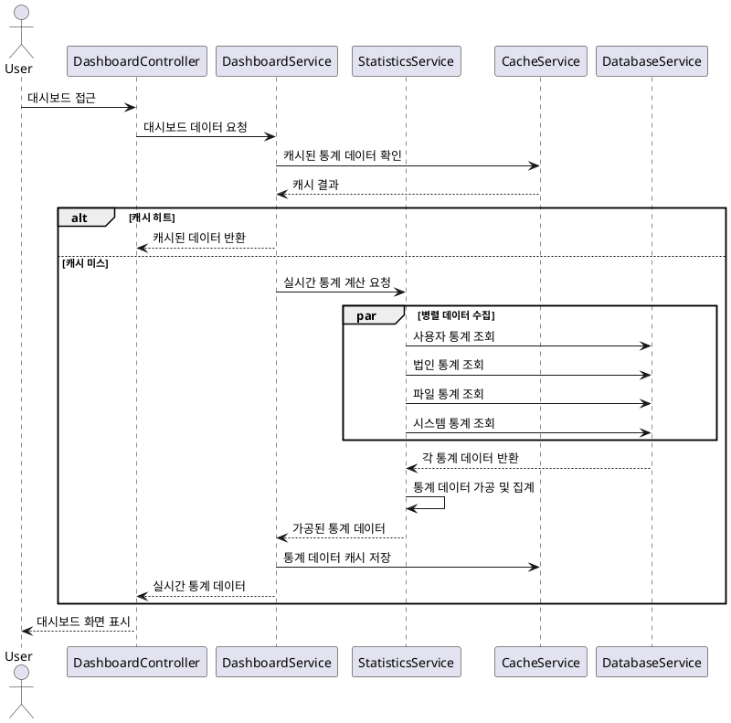
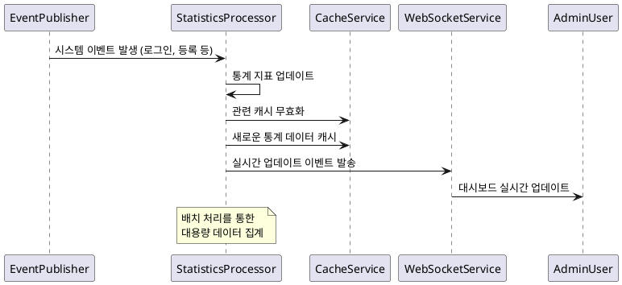
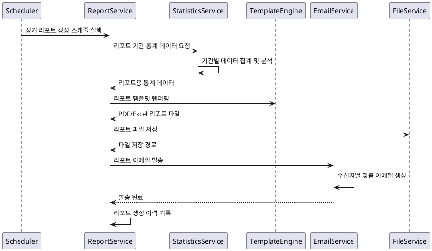

# 대시보드 및 통계 기능 요구사항 명세서

## 1. 개요

시스템의 핵심 지표와 통계 정보를 시각적으로 제공하는 대시보드 기능입니다. 사용자별 맞춤형 정보와 관리자용 시스템 모니터링 정보를 포함합니다.

## 2. 기능 요구사항

### 2.1 메인 대시보드

#### 2.1.1 사용자 대시보드

**FR-DASH-001: 개인 대시보드**

- **설명**: 로그인한 사용자의 개인화된 정보를 표시
- **포함정보**:
  - 개인 활동 요약 (등록한 법인 수, 업로드한 파일 수)
  - 최근 활동 내역 (최근 10건)
  - 즐겨찾기 법인 정보
  - 시스템 공지사항
- **개인화 설정**:
  - 위젯 배치 사용자 정의
  - 표시할 정보 선택
  - 새로고침 주기 설정

**FR-DASH-002: 빠른 작업 메뉴**

- **제공기능**:
  - 법인 정보 빠른 등록
  - 파일 빠른 업로드
  - 자주 사용하는 검색 조건
  - 최근 조회한 법인 정보
- **접근성**: 원클릭 접근 지원

#### 2.1.2 관리자 대시보드

**FR-DASH-003: 시스템 현황 대시보드**

- **설명**: 시스템 전반의 상태와 지표를 표시
- **포함정보**:
  - 시스템 리소스 사용률 (CPU, 메모리, 디스크)
  - 활성 사용자 수 (실시간, 일별, 월별)
  - 데이터 현황 (총 법인 수, 파일 수, 저장용량)
  - 서비스 상태 (API 응답시간, 오류율)
- **실시간 업데이트**: 30초 간격 자동 새로고침

**FR-DASH-004: 운영 모니터링**

- **모니터링 항목**:
  - 로그인 통계 (성공/실패)
  - API 호출 통계
  - 에러 발생 현황
  - 보안 이벤트 현황
- **알림기능**: 임계치 초과 시 실시간 알림

### 2.2 통계 분석

#### 2.2.1 지역별 통계

**FR-DASH-005: 지역별 법인 분포**

- **설명**: 지역별 법인 등록 현황과 통계를 제공
- **통계정보**:
  - 시도별 법인 수 및 비율
  - 시군구별 상세 분포
  - 업종별 지역 분포
  - 시간별 등록 추이
- **시각화**:
  - 지도 기반 히트맵
  - 막대 차트
  - 원형 차트
  - 트렌드 라인

**FR-DASH-006: 지역별 활성도 분석**

- **분석지표**:
  - 지역별 사용자 활동도
  - 법인 등록 완료율
  - 지역별 검색 빈도
  - 업종 다양성 지수
- **랭킹시스템**: 상위 지역 순위 제공

#### 2.2.2 시간별 통계

**FR-DASH-007: 시계열 데이터 분석**

- **분석기간**: 시간별, 일별, 주별, 월별, 연별
- **분석항목**:
  - 신규 회원 가입 추이
  - 법인 등록 추이
  - 파일 업로드 추이
  - 시스템 사용률 추이
- **비교분석**: 전년 동기 대비, 전월 대비 증감률

### 2.3 사용자 활동 통계

#### 2.3.1 사용자 행동 분석

**FR-DASH-008: 사용자 활동 패턴 분석**

- **분석내용**:
  - 로그인 패턴 (시간대별, 요일별)
  - 기능 사용 빈도
  - 세션 지속 시간
  - 페이지 체류 시간
- **세그먼트 분석**: 사용자 역할별, 지역별 패턴 비교

**FR-DASH-009: 사용자 참여도 측정**

- **측정지표**:
  - 일간 활성 사용자 (DAU)
  - 주간 활성 사용자 (WAU)
  - 월간 활성 사용자 (MAU)
  - 사용자 리텐션율
- **코호트 분석**: 가입 시기별 사용자 유지율

#### 2.3.2 컨텐츠 통계

**FR-DASH-010: 법인 정보 통계**

- **통계항목**:
  - 업종별 등록 현황
  - 등록자별 기여도
  - 인기 검색 키워드
  - 데이터 품질 지표
- **트렌드 분석**: 인기 업종 변화, 등록 패턴 변화

**FR-DASH-011: 파일 사용 통계**

- **통계항목**:
  - 파일 형식별 업로드 현황
  - 다운로드 랭킹
  - 저장소 사용률
  - 파일 공유 패턴
- **용량 관리**: 사용자별 용량 사용률, 정리 대상 파일

### 2.4 리포트 생성

#### 2.4.1 정기 리포트

**FR-DASH-012: 자동 리포트 생성**

- **리포트 종류**:
  - 일간 운영 리포트
  - 주간 사용자 활동 리포트
  - 월간 통계 리포트
  - 분기별 성장 리포트
- **배포방식**: 이메일 자동 발송, 대시보드 내 열람

**FR-DASH-013: 맞춤형 리포트**

- **설정옵션**:
  - 리포트 주기 선택
  - 포함할 지표 선택
  - 수신자 설정
  - 출력 형식 선택 (PDF, Excel)
- **스케줄링**: 원하는 시간에 자동 생성

#### 2.4.2 임시 리포트

**FR-DASH-014: 온디맨드 리포트**

- **생성기능**: 원하는 기간과 조건으로 즉시 리포트 생성
- **내보내기**: PDF, Excel, CSV 형식 지원
- **공유기능**: 리포트 링크 생성 및 공유

## 3. 시퀀스 다이어그램

### 3.1 대시보드 데이터 로딩



### 3.2 실시간 통계 업데이트



### 3.3 리포트 생성 프로세스



## 4. 비기능 요구사항

### 4.1 성능 요구사항

**NFR-DASH-001: 응답 시간**

- 대시보드 로딩: 3초 이내
- 통계 차트 렌더링: 2초 이내
- 실시간 데이터 업데이트: 1초 이내

**NFR-DASH-002: 데이터 처리**

- 통계 계산: 100만 건 데이터 기준 30초 이내
- 리포트 생성: 10초 이내
- 캐시 응답: 100ms 이내

### 4.2 확장성 요구사항

**NFR-DASH-003: 데이터 확장성**

- 통계 데이터: 1억 건까지 처리 가능
- 동시 대시보드 사용자: 1,000명
- 리포트 생성: 시간당 100개

### 4.3 가용성 요구사항

**NFR-DASH-004: 서비스 안정성**

- 대시보드 서비스: 99.9%
- 통계 계산 실패 시에도 기본 정보 표시
- 캐시 서버 장애 시 데이터베이스 직접 조회

## 5. 데이터 모델

### 5.1 Statistics Cache 테이블

```sql
- id: BIGINT (PK)
- cache_key: VARCHAR(200) NOT NULL (UK)
- cache_data: JSON NOT NULL
- cache_type: ENUM('DASHBOARD', 'REPORT', 'CHART', 'SUMMARY')
- expires_at: TIMESTAMP NOT NULL
- created_at: TIMESTAMP NOT NULL
- updated_at: TIMESTAMP

INDEX idx_cache_key (cache_key)
INDEX idx_cache_type_expires (cache_type, expires_at)
```

### 5.2 Daily Statistics 테이블

```sql
- id: BIGINT (PK)
- stat_date: DATE NOT NULL
- stat_type: VARCHAR(50) NOT NULL
- stat_key: VARCHAR(100) NOT NULL
- stat_value: BIGINT NOT NULL
- additional_data: JSON
- created_at: TIMESTAMP

INDEX idx_date_type_key (stat_date, stat_type, stat_key)
UNIQUE KEY uk_date_type_key (stat_date, stat_type, stat_key)
```

### 5.3 Report Schedule 테이블

```sql
- id: BIGINT (PK)
- report_name: VARCHAR(200) NOT NULL
- report_type: ENUM('DAILY', 'WEEKLY', 'MONTHLY', 'QUARTERLY')
- schedule_cron: VARCHAR(100)
- recipients: JSON -- 이메일 주소 배열
- template_config: JSON
- is_active: BOOLEAN DEFAULT true
- last_generated_at: TIMESTAMP
- next_scheduled_at: TIMESTAMP
- created_by: BIGINT (FK to Member)
- created_at: TIMESTAMP
- updated_at: TIMESTAMP
```

### 5.4 User Dashboard Config 테이블

```sql
- id: BIGINT (PK)
- member_id: BIGINT (FK to Member) NOT NULL (UK)
- widget_config: JSON NOT NULL
- layout_config: JSON
- refresh_interval: INT DEFAULT 300 -- seconds
- theme: VARCHAR(20) DEFAULT 'default'
- created_at: TIMESTAMP
- updated_at: TIMESTAMP
```

## 6. API 명세

### 6.1 대시보드 데이터 조회 API

```http
GET /api/dashboard/summary
Authorization: Bearer {JWT_TOKEN}

Response:
{
  "success": true,
  "data": {
    "userStats": {
      "totalMembers": 1250,
      "activeToday": 89,
      "newThisMonth": 45
    },
    "corporationStats": {
      "totalCorporations": 5670,
      "verifiedPercentage": 87.5,
      "newThisWeek": 23
    },
    "fileStats": {
      "totalFiles": 3421,
      "totalSize": "2.3GB",
      "uploadsToday": 15
    },
    "systemStats": {
      "cpuUsage": 45.2,
      "memoryUsage": 68.7,
      "diskUsage": 34.1,
      "uptime": "15d 6h 23m"
    },
    "lastUpdatedAt": "2024-01-01T12:00:00"
  }
}
```

### 6.2 지역별 통계 조회 API

```http
GET /api/dashboard/statistics/regions?level=sido&period=month
Authorization: Bearer {JWT_TOKEN}

Response:
{
  "success": true,
  "data": {
    "period": "2024-01",
    "regions": [
      {
        "regionCode": "11",
        "regionName": "서울특별시",
        "corporationCount": 1245,
        "percentage": 22.5,
        "growth": 5.2,
        "rank": 1
      },
      {
        "regionCode": "26",
        "regionName": "부산광역시",
        "corporationCount": 678,
        "percentage": 12.3,
        "growth": 3.1,
        "rank": 2
      }
    ],
    "total": 5523,
    "generatedAt": "2024-01-01T12:00:00"
  }
}
```

### 6.3 차트 데이터 조회 API

```http
GET /api/dashboard/charts/time-series?metric=registrations&period=7d&interval=daily
Authorization: Bearer {JWT_TOKEN}

Response:
{
  "success": true,
  "data": {
    "metric": "registrations",
    "period": "7d",
    "interval": "daily",
    "data": [
      {
        "date": "2024-01-01",
        "value": 23,
        "label": "1월 1일"
      },
      {
        "date": "2024-01-02",
        "value": 31,
        "label": "1월 2일"
      }
    ],
    "summary": {
      "total": 187,
      "average": 26.7,
      "growth": 12.5
    }
  }
}
```

### 6.4 리포트 생성 API

```http
POST /api/dashboard/reports/generate
Authorization: Bearer {JWT_TOKEN}
Content-Type: application/json

{
  "reportType": "monthly",
  "period": {
    "start": "2024-01-01",
    "end": "2024-01-31"
  },
  "sections": [
    "userStats",
    "corporationStats",
    "regionAnalysis",
    "trends"
  ],
  "format": "pdf"
}

Response:
{
  "success": true,
  "message": "리포트 생성이 시작되었습니다.",
  "data": {
    "reportId": "RPT_20240101_001",
    "estimatedCompletionTime": "2024-01-01T12:05:00",
    "downloadUrl": "/api/reports/RPT_20240101_001/download"
  }
}
```

## 7. 차트 및 시각화

### 7.1 지원하는 차트 유형

- **라인 차트**: 시간별 추이 분석
- **막대 차트**: 카테고리별 비교
- **원형 차트**: 비율 및 구성 분석
- **히트맵**: 지역별 분포 시각화
- **게이지 차트**: 실시간 지표 표시
- **트리맵**: 계층적 데이터 표현

### 7.2 인터랙티브 기능

- **드릴다운**: 차트 클릭으로 상세 정보 조회
- **필터링**: 동적 데이터 필터링
- **줌**: 특정 기간 확대/축소
- **툴팁**: 마우스오버 상세 정보 표시

## 8. 테스트 케이스

### 8.1 정상 케이스

- TC-DASH-001: 대시보드 정상 로딩 및 데이터 표시
- TC-DASH-002: 지역별 통계 차트 렌더링
- TC-DASH-003: 실시간 데이터 업데이트
- TC-DASH-004: 리포트 생성 및 다운로드
- TC-DASH-005: 사용자 맞춤 대시보드 설정

### 8.2 성능 테스트

- TC-DASH-006: 대용량 데이터 통계 계산 성능
- TC-DASH-007: 동시 다중 사용자 대시보드 접근
- TC-DASH-008: 캐시 효율성 테스트
- TC-DASH-009: 복잡한 차트 렌더링 성능

### 8.3 예외 케이스

- TC-DASH-010: 데이터베이스 연결 실패 시 처리
- TC-DASH-011: 캐시 서버 장애 시 폴백
- TC-DASH-012: 통계 계산 오류 시 기본값 표시
- TC-DASH-013: 리포트 생성 실패 시 오류 처리

## 9. 구현 시 고려사항

### 9.1 성능 최적화

- 통계 데이터 사전 계산 및 캐싱
- 대용량 데이터 집계를 위한 배치 처리
- 차트 렌더링 최적화 (가상화, 샘플링)
- CDN을 통한 정적 자원 캐싱

### 9.2 사용자 경험

- 직관적인 대시보드 인터페이스 설계
- 반응형 디자인으로 모바일 지원
- 로딩 상태 및 진행률 표시
- 접근성 고려 (색상, 대비, 스크린 리더)

### 9.3 데이터 정확성

- 실시간 데이터와 배치 데이터 일관성 유지
- 통계 계산 로직 검증
- 데이터 품질 모니터링
- 이상 데이터 감지 및 알림

### 9.4 확장성 준비

- 새로운 지표 추가 용이성
- 차트 라이브러리 교체 대응
- 다양한 데이터 소스 연동 준비
- 마이크로서비스 분리 고려
