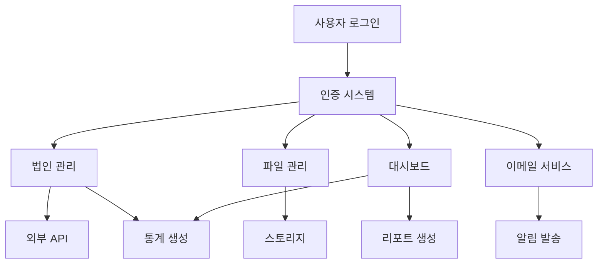
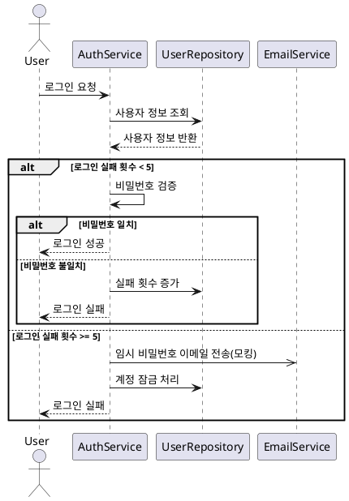

# 프로젝트 기능 요구사항 명세서

## 📋 개요

이 디렉토리는 **Antock Public Data Harvester** 프로젝트의 기능별 요구사항 명세서를 포함하고 있습니다. 각 문서는 시스템의 핵심 기능에 대한 상세한 요구사항, 시퀀스 다이어그램, API 명세, 테스트 케이스 등을 포함합니다.

## 📁 문서 구조

### 🔐 인증 및 보안

- **[01_authentication.md](./01_authentication.md)** - 로그인/인증 기능
- **[04_security_account_lock.md](./04_security_account_lock.md)** - 보안 및 계정 잠금 기능

### 👥 사용자 관리

- **[02_user_management.md](./02_user_management.md)** - 사용자 관리 기능
- **[03_email_service.md](./03_email_service.md)** - 이메일 서비스 기능

### 🏢 핵심 업무 기능

- **[05_corporation_management.md](./05_corporation_management.md)** - 법인 정보 관리 기능
- **[06_file_management.md](./06_file_management.md)** - 파일 관리 기능

### 📊 분석 및 모니터링

- **[07_dashboard_statistics.md](./07_dashboard_statistics.md)** - 대시보드 및 통계 기능

## 🎯 주요 기능 개요

### 1. 로그인/인증 시스템 (Authentication)

- JWT 기반 인증
- 로그인 실패 시 계정 잠금 (5회 초과)
- 임시 비밀번호 이메일 발송
- Rate Limiting 적용

**핵심 시퀀스**:

```
사용자 → 로그인 시도 → 실패 횟수 확인 →
  ├─ 5회 미만: 비밀번호 검증 → 성공/실패 처리
  └─ 5회 이상: 계정 잠금 → 임시 비밀번호 발송
```

### 2. 사용자 관리 시스템 (User Management)

- 회원 가입 승인 프로세스
- 역할 기반 권한 관리 (USER, MANAGER, ADMIN)
- 계정 상태 관리 (PENDING, APPROVED, SUSPENDED, REJECTED)
- 관리자 도구 제공

### 3. 이메일 서비스 (Email Service)

- 템플릿 기반 이메일 시스템
- 비동기 이메일 발송 (모킹)
- 다국어 지원 (한국어, 영어)
- 발송 이력 관리

### 4. 보안 및 계정 잠금 (Security)

- 브루트 포스 공격 방지
- IP 기반 Rate Limiting
- 비밀번호 정책 강제
- 보안 이벤트 로깅

### 5. 법인 정보 관리 (Corporation Management)

- 법인/사업자 정보 CRUD
- 외부 API 연동 검증 (국세청 API)
- 지역별 통계 제공
- Excel 내보내기 기능
- 대량 등록 (CSV 업로드)

### 6. 파일 관리 (File Management)

- 다중 스토리지 지원 (Local, MinIO)
- 파일 업로드/다운로드
- 메타데이터 관리
- 자동 정리 및 백업

### 7. 대시보드 및 통계 (Dashboard & Statistics)

- 실시간 시스템 모니터링
- 지역별 법인 분포 시각화
- 사용자 활동 분석
- 자동 리포트 생성

## 🔄 시스템 간 연동



## 📋 공통 요구사항

### 비기능 요구사항

- **성능**: API 응답시간 3초 이내
- **보안**: JWT 인증, HTTPS 통신
- **가용성**: 99.9% 서비스 가동률
- **확장성**: 마이크로서비스 아키텍처 대응

### 기술 스택

- **Backend**: Java 17, Spring Boot 3.4.4
- **Database**: MySQL, Redis (캐시)
- **Storage**: Local File System, MinIO
- **Security**: JWT, BCrypt
- **Monitoring**: 시스템 메트릭, 로그 관리

## 📖 문서 읽는 방법

각 기능별 문서는 다음과 같은 구조로 작성되어 있습니다:

1. **개요** - 기능의 목적과 범위
2. **기능 요구사항** - 상세한 기능 명세
3. **시퀀스 다이어그램** - 프로세스 흐름
4. **비기능 요구사항** - 성능, 보안, 가용성 요구사항
5. **데이터 모델** - 데이터베이스 스키마
6. **API 명세** - REST API 인터페이스
7. **테스트 케이스** - 정상/예외 케이스
8. **구현 시 고려사항** - 개발 가이드라인

## 🔍 시퀀스 다이어그램 예시

각 문서에는 PlantUML로 작성된 시퀀스 다이어그램이 포함되어 있습니다. 예를 들어, 로그인 실패 처리 시퀀스:



## 🚀 구현 우선순위

### Phase 1 (핵심 기능)

1. 인증 시스템 구축
2. 사용자 관리 기능
3. 기본 법인 정보 관리

### Phase 2 (확장 기능)

1. 파일 관리 시스템
2. 이메일 서비스 연동
3. 보안 강화

### Phase 3 (분석 기능)

1. 대시보드 구축
2. 통계 및 리포트
3. 고급 검색 기능

## 📞 문의사항

각 기능에 대한 상세한 질문이나 요구사항 변경은 해당 문서의 이슈로 등록하거나 개발팀에 문의해 주세요.

---

> 📝 **Note**: 이 문서들은 개발 과정에서 지속적으로 업데이트될 예정입니다. 최신 버전을 확인하여 개발을 진행해 주세요.
